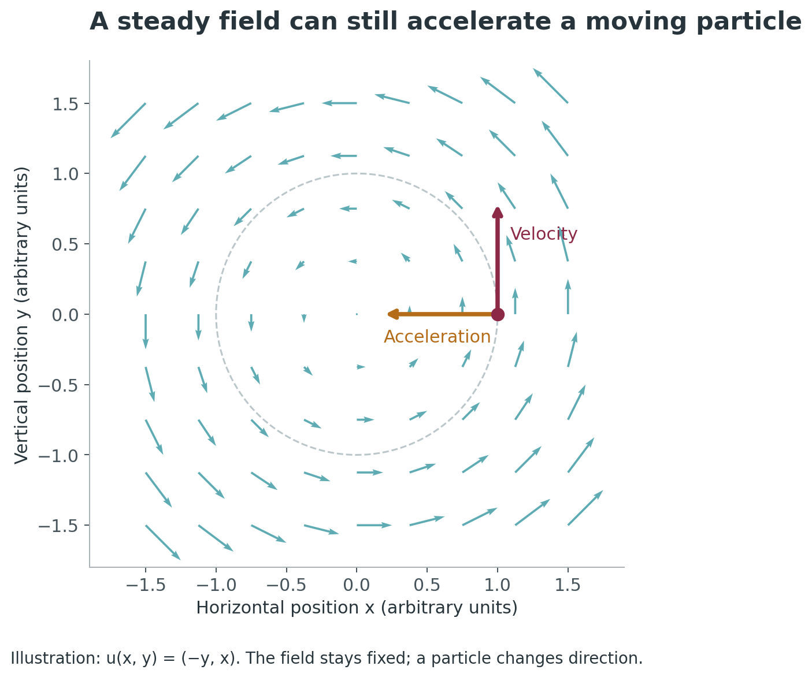
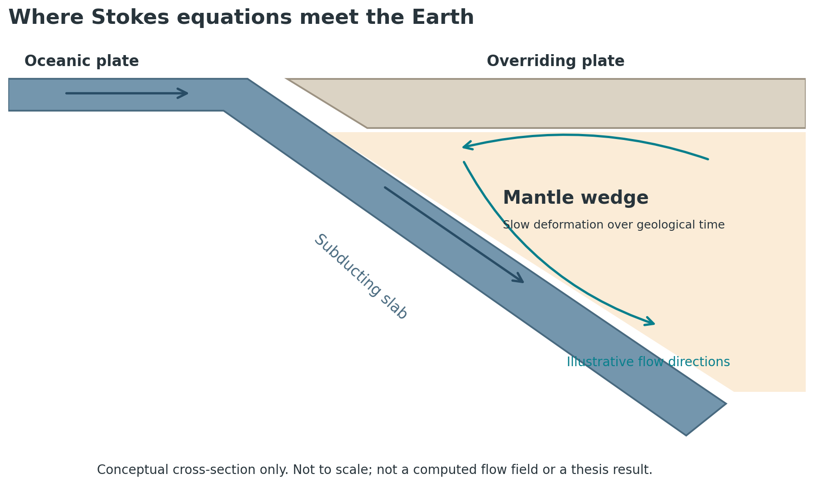
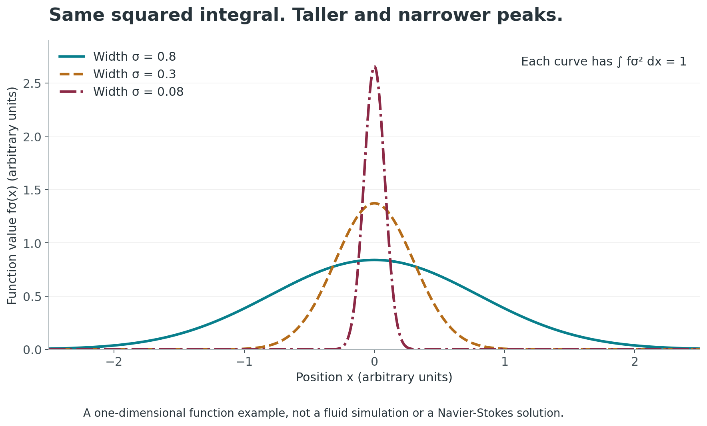

# From Mantle Flow to a Million-Dollar Question: My Way Into Navier-Stokes

*An undergraduate math major's guide to the equations, the recent announcement, and the questions I think are worth asking.*

*Written September 16, 2026. The discussion of recent developments reflects the sources available on this date.*

When I see Navier-Stokes in the news, I think about my undergraduate thesis.

I worked on **partial differential equations, specifically Stokes equations for modeling mantle-wedge flow**. We did not have a PDE class in our undergraduate coursework, so studying them for my thesis meant getting to know a subject that was new to me. It also gave me a personal reason to care about equations that describe how things move.

Now there is a major announcement about the Navier-Stokes Millennium Prize Problem, along with a very public conversation about AI, mathematical credit, and what it means to understand a proof.

I want to talk about both the mathematics and the conversation around it. But I want to do it from where I actually stand: as a math student who met PDEs through a thesis, writing for fellow students who may never have taken a PDE course.

If you know what a function and a derivative are, we have somewhere to begin.

## First, What Has Actually Happened?

On September 8, 2026, OpenAI announced a proposed resolution involving **finite-time blowup in the three-dimensional incompressible Navier-Stokes equations with a smooth external force**. It released a manuscript and a Lean formalization. [OpenAI's announcement](https://openai.com/index/navier-stokes-solution/)

Clay's September 11 statement welcomed the apparent settlement while emphasizing its evaluation process. That is significant recognition, but it is not a prize award. Clay's published rules require publication in a qualifying outlet, at least two years after publication, and general acceptance by the mathematical community before it considers a proposed solution. [Clay's statement](https://www.claymath.org/news/navier-stokes-announcement/), [prize rules](https://www.claymath.org/millennium-problems/rules/)

So there is substantial mathematics to discuss here. There are also distinctions that a headline can easily lose. Let's build enough intuition to see them.

## A PDE Is an Equation Whose Unknown Is a Function

Think about the difference between these two questions:

- What number $x$ satisfies $x^2=4$?
- What function describes the velocity of a fluid at every position and every time?

The second question asks for much more information.

For a three-dimensional fluid, we write its velocity as

$$
\mathbf u(x,y,z,t)=\bigl(u_1(x,y,z,t),u_2(x,y,z,t),u_3(x,y,z,t)\bigr).
$$

At each location and time, this function gives us an arrow. Its direction tells us where the fluid is moving; its length tells us how fast.

A **partial derivative** measures change with respect to one variable while holding the others fixed. For example, $\partial\mathbf u/\partial t$ measures how the velocity changes with time at a fixed location. A **partial differential equation**, or PDE, relates a function to some of these partial derivatives.

That is our starting picture: a whole collection of arrows, connected by rules about how they can change.

## Reading the Equation One Piece at a Time

For an incompressible fluid with constant density and constant positive viscosity, a standard form is

$$
\frac{\partial\mathbf u}{\partial t}
+(\mathbf u\cdot\nabla)\mathbf u
=-\nabla p+\nu\Delta\mathbf u+\mathbf f,
\qquad
\nabla\cdot\mathbf u=0.
$$

Here $p$ is pressure divided by the constant density, $\nu>0$ is kinematic viscosity, and $\mathbf f$ is force per unit mass. This is a momentum equation coupled to an incompressibility condition. [John K. Hunter's PDE notes, Section 6.7](https://www.math.ucdavis.edu/~hunter/pdes/pde_notes.pdf)

Before worrying about the symbols, read it as a sentence:

> A fluid particle accelerates because of pressure differences, viscous effects, and external forces.

The symbols describe different parts of that sentence.

| Term | A way to read it |
| --- | --- |
| $\partial_t\mathbf u$ | How velocity changes at the place where you are watching |
| $(\mathbf u\cdot\nabla)\mathbf u$ | How velocity changes because a particle moves to a different place |
| $-\nabla p$ | Acceleration caused by pressure differences |
| $\nu\Delta\mathbf u$ | Viscous spreading of momentum between neighboring regions |
| $\mathbf f$ | An external force acting on the fluid, per unit mass |
| $\nabla\cdot\mathbf u=0$ | A tiny moving volume of fluid keeps its volume |

The gradient $\nabla p$ collects spatial derivatives of pressure. The Laplacian $\Delta\mathbf u$ adds second spatial derivatives of each velocity component. The divergence $\nabla\cdot\mathbf u$ measures local expansion or contraction.

Incompressibility does not mean the fluid cannot move. It means that a tiny parcel can change shape while keeping its volume.

### The Term That Took Me Beyond “Just Differentiate in Time”

Suppose the arrows in a flow diagram never change. Does that mean a particle following them has zero acceleration?

**Pause and picture a particle moving around a circle.**

Its speed could stay constant while its direction changes. Since velocity includes direction, it is still accelerating.

*The arrows form the steady field $\mathbf u(x,y)=(-y,x)$. A moving particle changes direction even though the field has no explicit time dependence. This illustrates the transport term; it is not a finite-energy example for the Millennium problem.*

That is why the acceleration contains both $\partial_t\mathbf u$ and $(\mathbf u\cdot\nabla)\mathbf u$. One part accounts for change at a fixed place. The other accounts for moving through a field that varies from place to place.

The second part is also **nonlinear**: the unknown velocity multiplies derivatives of that same unknown velocity. Knowing what happens for two separate flows does not, in general, let us add them to get another solution.

## Why This Feels Close to Home: My Thesis on Stokes Flow

The **mantle wedge** is the region above a subducting tectonic plate and below the overriding plate. It gives us a striking setting for thinking about flow: rock can undergo slow deformation over geological timescales, even though it behaves as a solid on everyday timescales.

*An explanatory schematic, not a figure from my thesis or a computed flow field. The arrows indicate possible flow directions in an idealized setting.*

In mantle-flow modeling, viscous effects dominate inertia. The comparison is expressed by the Reynolds number,

$$
\mathrm{Re}=\frac{UL}{\nu},
$$

where $U$ is a characteristic speed and $L$ a characteristic length. A very small Reynolds number motivates neglecting inertial effects. Mantle convection is a classic setting for this approximation. [Yanick Ricard, “Physics of Mantle Convection”](https://perso.univ-lyon1.fr/yanick.ricard/Article/112.pdf)

For a simple steady, incompressible, constant-viscosity model, the momentum balance becomes the **Stokes equations**:

$$
-\nu\Delta\mathbf u+\nabla p=\mathbf f,
\qquad
\nabla\cdot\mathbf u=0.
$$

The familiar pressure, viscosity, and force terms remain. The inertial acceleration terms are absent. More realistic mantle models can involve variable viscosity, temperature, and other coupled equations; the display above is an introduction to the relationship, not a specification of my thesis model. [ASPECT's equations for mantle convection](https://aspect-documentation.readthedocs.io/en/latest/user/methods/basic-equations/index.html)

This is my connection to the topic. My thesis concerned Stokes equations and mantle-wedge flow. It did not address the Millennium Prize Problem, but it gave me a way into the language of fluid equations.

When I look at Navier-Stokes now, I recognize some of its pieces. I also see how much more demanding the full time-dependent, nonlinear question is.

## What Does “Solve Navier-Stokes” Mean?

This phrase can mean different things.

Computing an approximate flow around an object is one task. Finding a formula for a special flow is another. Proving that an entire class of flows has a certain property is another still.

The Millennium problem belongs to the third kind. It concerns **existence and smoothness in three dimensions**, with carefully specified initial conditions, domains, and forces.

Its official formulation allows several routes to a resolution. Alternatives A and B ask for global smooth solutions with zero external force, in the whole space or a periodic setting. Alternatives C and D allow suitably smooth external forces and ask for examples where global smoothness breaks down. [Charles Fefferman's official problem statement](https://www.claymath.org/wp-content/uploads/2022/06/navierstokes.pdf)

In undergraduate language, the central tension is:

> If the fluid starts in a smooth state, can its equations drive it into behavior that cannot remain smooth for all future time?

“Smooth” has a precise mathematical meaning involving derivatives. A **singularity** is a failure of the required regularity. In the current manuscript, the claimed failure is particularly concrete: the velocity becomes unbounded in a finite amount of time.

A finite-time blowup is different from something merely becoming very large after a very long time. For a basic analogy, the function

$$
a(t)=\frac{1}{1-t},\qquad 0\leq t<1,
$$

is finite at every time before $1$, but grows without bound as $t$ approaches $1$.

This little function is not a fluid solution. It just makes “finite time” easier to picture.

## How Can Speed Blow Up While Energy Stays Bounded?

This is the part I would bring to a conversation with fellow analysis students.

For constant density normalized to one, kinetic energy is

$$
E(t)=\frac12\int_{\mathbb R^3}|\mathbf u(x,t)|^2\,dx.
$$

An integral measures accumulated size. It does not automatically control the largest value at a point. A peak can grow taller while occupying a smaller region.

*Each curve has squared integral equal to one. This is a one-dimensional function example, not a Navier-Stokes solution or a picture of the announced construction.*

Here is an explicit family behind the picture:

$$
f_\sigma(x)=(\pi\sigma^2)^{-1/4}
\exp\left(-\frac{x^2}{2\sigma^2}\right),
\qquad \sigma>0.
$$

For every width $\sigma$,

$$
\int_{\mathbb R}|f_\sigma(x)|^2\,dx=1.
$$

Yet its peak is

$$
f_\sigma(0)=(\pi\sigma^2)^{-1/4}\longrightarrow\infty
\quad\text{as }\sigma\downarrow0.
$$

If you have studied $L^p$ spaces, this is a familiar distinction in a new setting: controlling an $L^2$ norm does not generally control an $L^\infty$ norm.

> Before reading on: if you knew only the total energy, what would you still want to know about where that energy is concentrated?

Of course, drawing a narrow peak is much easier than proving that a velocity field with such behavior satisfies Navier-Stokes. The PDE places strong restrictions on which changes are possible. That is where the hard mathematics lives.

## A Little History Before the Headlines

These equations have a long history. Navier's work dates to 1822, and Stokes's treatment of internal friction in fluids to 1845. They belong to a broader nineteenth-century effort to express fluid motion mathematically. [Peter Lynch's historical lecture on Stokes](https://maths.ucd.ie/~plynch/Talks/STOKES-AHOY.pdf)

A major twentieth-century milestone came with **Jean Leray's 1934 work**. He established global existence of weak solutions for the three-dimensional incompressible equations. A weak solution satisfies an integrated version of the equations and need not have all the derivatives required of a classical smooth solution. That distinction left a difficult regularity question to resolve. [Ożański and Pooley's review of Leray's work](https://arxiv.org/abs/1708.09787)

In 2000, Clay included Navier-Stokes among its seven Millennium Prize Problems, each associated with a million-dollar prize. The prize brought wider attention to a question that already had a substantial mathematical history. [Clay Mathematics Institute](https://www.claymath.org/news/navier-stokes-announcement/)

I think that history is worth keeping in view. A breakthrough can arrive in an announcement, but the language, techniques, and questions that make it possible are built over generations.

## The Crucial Word in the Current Result: “Forced”

The new manuscript claims a construction for every positive viscosity that starts with zero velocity, uses a smooth force supported in a bounded region of space and a finite time interval, and develops unbounded velocity while keeping kinetic energy bounded. It identifies this as a resolution of Clay's alternatives C and D. [The manuscript, Theorem 1.1](https://cdn.openai.com/pdf/32d9f210-8b73-45e0-91bc-82a30aef8a9a/navier-stokes.pdf)

Why does the force matter?

Imagine setting a fluid in motion by acting on it. A force that is already singular would leave an obvious question: did we simply put the bad behavior into the input? Requiring the force to remain smooth makes the proposed construction much more demanding.

At the same time, **a forced blowup result does not by itself prove blowup in the unforced case**. The two statements have different hypotheses. Clay's permitted breakdown routes do allow forcing, so this distinction is about accurately reading the claim, not dismissing it. [Official formulation, alternatives A–D](https://www.claymath.org/wp-content/uploads/2022/06/navierstokes.pdf)

It also does not mean that every fluid flow becomes singular, that turbulence and singularity are the same thing, or that existing simulations suddenly become useless. The result concerns what can happen for specially constructed data within a precise mathematical model.

## Why Is the Community Arguing?

There are several conversations happening at once, and I find it helpful to separate them.

### 1. What exactly has been proved?

A manuscript and a formal proof offer different ways to inspect a result. The released repository includes Lean formalizations and instructions for building and independently checking them. [Formalization repository](https://github.com/openai/NavierStokesAndEuler)

A proof assistant checks a formal statement against its definitions and assumptions. Human readers still need to understand that statement, how it matches the mathematical question, and which ideas make the argument work. I have not independently audited this proof, so I am discussing its stated result and public reception rather than certifying it myself.

### 2. Who deserves credit, and how was unpublished work handled?

Tristan Buckmaster's public statement describes his work with Levent Alpöge on related forced fluid equations, credits earlier ideas by Diego Córdoba and Luis Martínez-Zoroa, and raises concerns about the timing of OpenAI's effort and proposed authorship arrangements. He also asks about the treatment of unpublished work entered into AI tools. These are his account and concerns, not findings I can independently establish. [Buckmaster's statement](https://cims.nyu.edu/~tristanb/statement.pdf)

OpenAI says it did not access their unpublished work and, in its September 10 update, says its investigation ruled out influence from Buckmaster's recent Codex prompts, including through training. It also recognizes the priority of Alpöge and Buckmaster's forced Euler work. [OpenAI's response](https://openai.com/index/navier-stokes-solution/)

I do not think an undergraduate blog should turn a disputed account into a verdict. But the underlying questions deserve attention: can researchers safely develop unpublished ideas with these tools, and how should the people whose ideas enable a breakthrough be credited?

### 3. Who gets access to the tools?

The European Mathematical Society welcomed the development while raising questions about authorship, credit, and unequal access to an internal model. It also emphasized the work of earlier mathematicians, including Córdoba, Martínez-Zoroa, and Fan Zheng. [EMS statement](https://euromathsoc.org/news/ems-statement-on-recent-navier-stokes-announcement-225)

As a student, I find the access question especially important. If powerful research tools are concentrated in a few institutions or companies, their effect on mathematics will depend partly on who gets to use them and under what conditions.

## What I Take from This as an Undergraduate

My reaction is a mixture of excitement and questions.

I am excited because this is mathematics connected to something I studied for my thesis. I want to understand how the ideas fit together, even if the full proof is far beyond what I can presently read with confidence.

I also want the explanation to be good. If a theorem matters this much, students should have a way to learn what it says without having to choose between a sensational headline and a research manuscript they cannot yet follow.

The same goes for the public discussion. Mathematical correctness, credit, privacy, and access are different questions. A result can be mathematically important while the process around it still deserves criticism and scrutiny.

And I do not take any of this as a reason to stop learning mathematics.

Understanding a derivative lets us read acceleration. Understanding vector fields lets us picture flow. Understanding an integral lets us see why bounded energy can coexist with growing peaks. Understanding hypotheses lets us distinguish a forced theorem from an unforced one.

Those are things we can work toward now, even without a PDE course.

## Back to the Mantle Wedge

My route into this subject was through slow flow beneath the Earth's surface. The current discussion concerns a much more demanding question about the full Navier-Stokes equations, but I can trace the connection through the terms on the page.

That is why this topic is close to my heart. A thesis can give you a small part of mathematics that you feel responsible for understanding, and suddenly a distant research announcement feels a little closer.

You do not have to follow every estimate in a proof to begin asking useful questions about it.

Start with the arrows. Ask what changes. Ask which assumptions matter. Then keep going.

**What would you want to explore next: how Stokes flow models the mantle, why energy estimates are so useful, or what a computer actually checks in a formal proof?**

---

*The three illustrations are original teaching figures prepared for this article. They are not outputs from my thesis or reproductions of the announced Navier-Stokes construction. Links throughout the article distinguish the official problem statement, the new claim, institutional reactions, and the researchers' own accounts. The status section should be revisited if this post is published after September 16, 2026.*
