# Math 146: Differential Geometry, Unit I

**Course notes:** Isaiah John L. Mariano, III - BS Mathematics  
**Professor:** Jade Ventura  
**Original template:** Jeremiah Daniel A. Regalario

These notes follow Meetings 1-14, including the February 19 reading assignment labeled Meeting 9.5, in the supplied Unit I notes. Repeated recaps are consolidated, exercises remain available for practice, and the supplied proof arguments are retained in a more compact form. Original illustrations are included; short explanations connect the definitions and results.

The main progression is **spaces → differentiation → tangent vectors → forms → curves → metric and covariant differentiation**. The last topic prepares us for the moving frames, curvature, and torsion of Unit II.

**Notation.** The coordinate functions on $\mathbb R^n$ are $x_1,\ldots,x_n$. The standard basis vectors are $u_i$, and the corresponding vector fields are $U_i$. We write $v_p=(p;v)$ for a vector with base point $p$. Unless stated otherwise, Euclidean spaces carry their standard topology and metric. All statements involving several fields or functions are understood on their common domain.

## Meeting 1 · January 21: Topology and subspaces

### Definition: A topology

A **topology** on a set $X$ is a collection $\mathcal T$ of subsets of $X$ satisfying:

1. $\varnothing,X\in\mathcal T$.
2. Every union of members of $\mathcal T$ belongs to $\mathcal T$.
3. Every finite intersection of members of $\mathcal T$ belongs to $\mathcal T$.

The pair $(X,\mathcal T)$ is a **topological space**. Members of $\mathcal T$ are **open sets**, their complements are **closed sets**, and an open set containing $p$ is an **open neighborhood** of $p$.

Topology tells us what it means to stay near a point. Different choices of open sets can give the same underlying set very different notions of nearness.

### Example: Dictionary order on the plane

Define the dictionary, or lexicographic, order by

$$
(a,b)<(c,d)\quad\Longleftrightarrow\quad
 a<c\ \text{or}\ (a=c\text{ and }b<d).
$$

An order interval is

$$
((a,b),(c,d))=\{(x,y):(a,b)<(x,y)<(c,d)\}.
$$

The dictionary topology consists of sets $U$ such that every $p\in U$ belongs to an order interval contained in $U$.

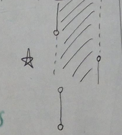

### Example: The standard topology

In $\mathbb R^2$, an open ball is

$$
B((a,b),r)=\{(x,y):\sqrt{(x-a)^2+(y-b)^2}<r\},\qquad r>0.
$$

A set $U$ is open in the standard topology if each of its points lies in a ball contained in $U$. The same definition works in $\mathbb R^n$ using Euclidean distance.

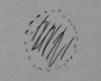

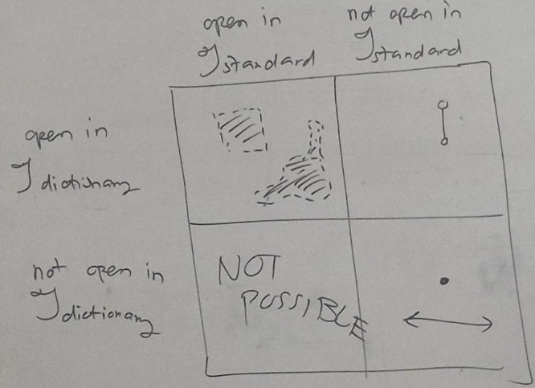

### Definition and Exercise 5.2: Interior and boundary

For $A\subseteq X$, a point is **interior to $A$** if it has an open neighborhood contained in $A$. A point is a **boundary point of $A$** if every open neighborhood meets both $A$ and $X\setminus A$. Write $A^\circ$ and $\partial A$ for the interior and boundary.

A boundary point need not belong to $A$. For example, the endpoints of an open interval are boundary points outside that interval.

Prove:

1. $A^\circ\subseteq A$, $A^\circ\cap\partial A=\varnothing$, and

$$
A=A^\circ\sqcup(\partial A\cap A).
$$

2. $A^\circ$ is the largest open set contained in $A$.
3. $A$ is open if and only if $A=A^\circ$.

The source refers to Exercise 1.10 for part 2 without reproducing it. The union of all open subsets contained in $A$ gives a direct route to the conclusion.

### Theorem: Subspace topology

If $Y\subseteq X$, then

$$
\mathcal T_Y=\{Y\cap U:U\in\mathcal T\}
$$

is a topology on $Y$, called the **subspace topology** inherited from $X$.

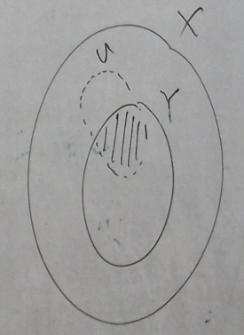

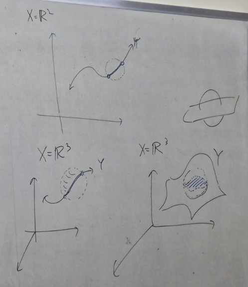

An open set in a subspace need not be open in the ambient space. The word “open” must always be read relative to the space under discussion.

## Meeting 2 · January 23: Smooth functions and tangent vectors

### Theorem: The sandwich descriptions of openness

A subset $U\subseteq\mathbb R^n$ is open precisely when each $p\in U$ lies in an open ball $B$ satisfying $p\in B\subseteq U$.

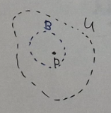

For $Y\subseteq\mathbb R^n$, a subset $V\subseteq Y$ is open in $Y$ precisely when, for every $q\in V$, there is an open ball $B$ with

$$
q\in B\cap Y\subseteq V.
$$

**Exercise.** Prove this equivalence from the definition of subspace topology.

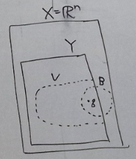

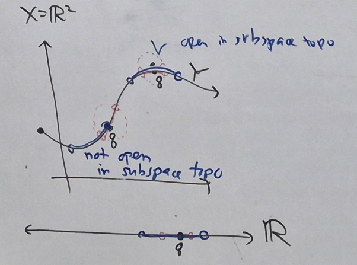

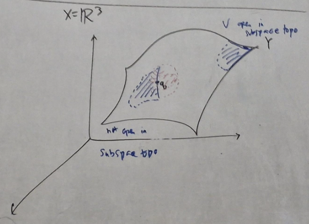

### Definition: Coordinates and smoothness

The **natural coordinate functions** are $x_i(p_1,\ldots,p_n)=p_i$. Thus $p=(x_1(p),\ldots,x_n(p))$, and $x_i(u_j)=\delta_{ij}$. In dimension three, write $x,y,z$.

For a map $f:X\to\mathbb R^m$, its component functions are $f_k=x_k\circ f$, so $f=(f_1,\ldots,f_m)$.

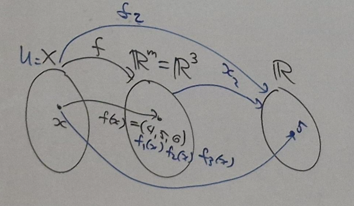

On an open set $U\subseteq\mathbb R^n$, a real-valued function is **smooth** if its partial derivatives of all orders exist and are continuous. A map into $\mathbb R^m$ is smooth when all its component functions are smooth. We write $C^\infty(U)$ for smooth real-valued functions on $U$.

The notation $\mathcal F_p(\mathbb R^n)$ refers to smooth real-valued functions defined on an open neighborhood of $p$. Different functions in this collection may have different domains.

### Exercise: Algebra of local smooth functions

For $f:W_f\to\mathbb R$ and $g:W_g\to\mathbb R$ in $\mathcal F_p(\mathbb R^n)$, define $af$ on $W_f$, and $f+g$ and $fg$ on $W_f\cap W_g$. Show that all three again belong to $\mathcal F_p(\mathbb R^n)$.

### Definition: Smooth extensions

For the source's convention, let $A\subseteq\mathbb R^n$ have nonempty interior. A **smooth extension** of $f:A\to\mathbb R^m$ is a smooth map $\widetilde f:\widetilde A\to\mathbb R^m$ on an open set containing $A$ that agrees with $f$ on $A$. We call $f$ smooth if such an extension exists.

This agrees with the earlier definition when $A$ is open. Write $C^\infty(A,B)$ for smooth maps into $\mathbb R^m$ with image contained in $B\subseteq\mathbb R^m$.

**Exercises.** Under this convention:

1. If $A\subseteq B$ and $A^\circ\ne\varnothing$, show that restricting a smooth map on $B$ to $A$ preserves smoothness.
2. Show that sums and scalar multiples of smooth maps are smooth.
3. For real-valued maps, show that products are smooth.

### Theorem: Smooth maps compose

If $f\in C^\infty(A,B)$ and $g\in C^\infty(B,C)$, then $g\circ f\in C^\infty(A,C)$.

**Proof.** Choose smooth extensions $\widetilde f:\widetilde A\to\mathbb R^m$ and $\widetilde g:\widetilde B\to\mathbb R^\ell$. The open set

$$
O=\widetilde f^{-1}(\widetilde B)\subseteq\widetilde A
$$

contains $A$, because $f(A)\subseteq B\subseteq\widetilde B$. The map $\widetilde g\circ\widetilde f|_O$ is a smooth extension of $g\circ f$, and $(g\circ f)(A)\subseteq C$. ∎

### Definition: Tangent vectors and tangent spaces

A **tangent vector** to $\mathbb R^n$ is a pair $v_p=(p;v)$: a base point $p$ and a vector part $v$. The **tangent space** at $p$ is

$$
T_p\mathbb R^n=\{(p;v):v\in\mathbb R^n\}.
$$

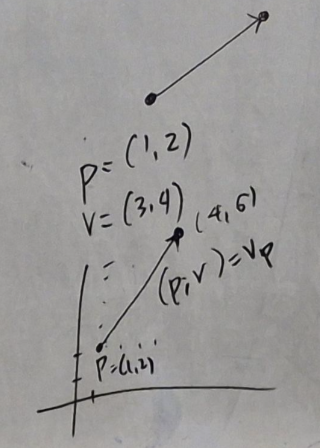

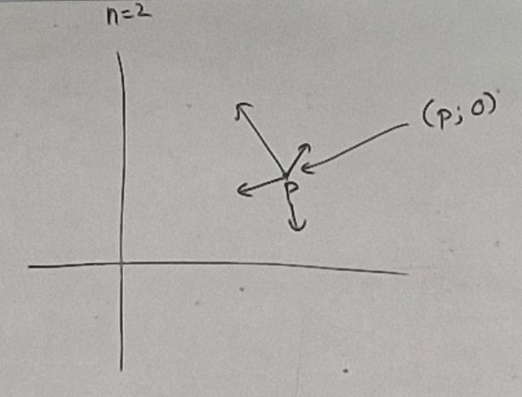

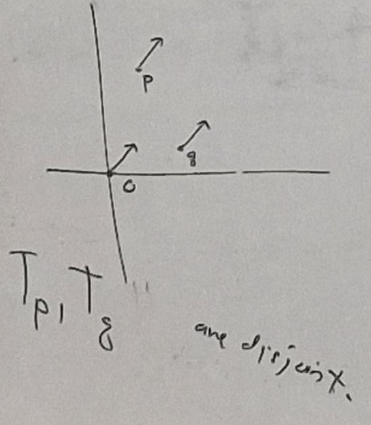

For $p\ne q$, the pairs $v_p$ and $v_q$ are different tangent vectors, even though their vector parts agree.

### Theorem and exercises: Vector-space structure

The operations

$$
v_p+w_p=(v+w)_p,\qquad a v_p=(av)_p
$$

make $T_p\mathbb R^n$ an $n$-dimensional real vector space, with zero vector $0_p$ and natural basis $u_1|_p,\ldots,u_n|_p$.

1. Verify the vector-space axioms and prove that the natural vectors form a basis.
2. Construct the canonical linear isomorphism $T_p\mathbb R^n\to\mathbb R^n$.
3. Construct the canonical linear isomorphism $T_p\mathbb R^n\to T_q\mathbb R^n$.

These isomorphisms explain why ordinary vector calculations work while we continue to keep track of base points.

### Definition: Directional derivative

For $f\in\mathcal F_p(\mathbb R^n)$, define

$$
v_p(f)=\left.\frac{d}{dh}f(p+hv)\right|_{h=0}
=\lim_{h\to0}\frac{f(p+hv)-f(p)}h.
$$

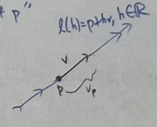

By the multivariable chain rule,

$$
v_p(f)=\sum_{i=1}^n v_i\,\partial_i f(p).
$$

For $n=1$, this is $v f'(p)$. In particular, $u_i|_p(f)=\partial_i f(p)$.

**Exercise.** Prove the chain-rule formula and the identity between a natural tangent vector and its partial-derivative operator.

## Meeting 3 · January 28: Derivations, differentials, and vector fields

### Exercises: Recovering vectors from derivatives

Prove the operator identities

$$
\begin{aligned}
v_p&=\sum_i v_p(x_i)u_i|_p,\\
\left(\sum_i a_i u_i|_p\right)(\,\cdot\,)
&=\sum_i a_i\partial_i|_p.
\end{aligned}
$$

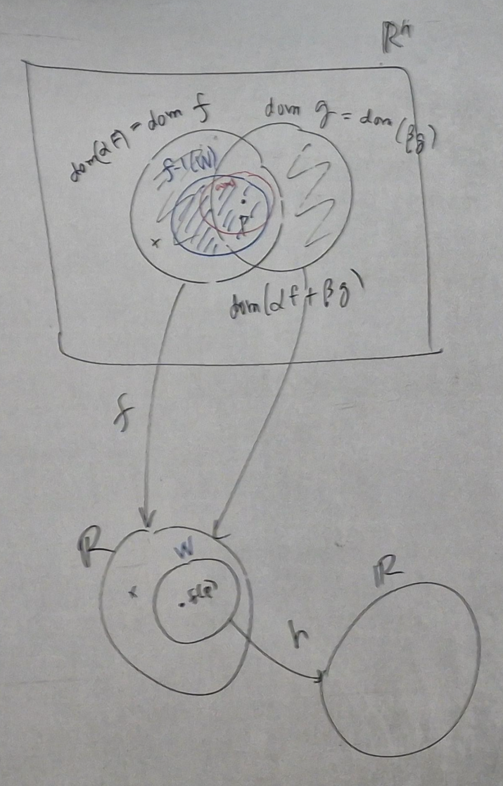

For $p=(1,2,3)$, determine $v_p$ from

$$
v_p(2x+y)=3,\qquad v_p(3x-y)=2,\qquad v_p(5+yz)=1.
$$

### Theorem: Calculus rules for tangent vectors

For tangent vectors $v_p,w_p$, local smooth functions $f,g$, real constants $a,b$, and a smooth real-valued function $h$ near $f(p)$,

$$
\begin{aligned}
v_p(af+bg)&=a v_p(f)+b v_p(g),\\
v_p(fg)&=v_p(f)g(p)+f(p)v_p(g),\\
v_p(h\circ f)&=h'(f(p))v_p(f),\\
(av_p+bw_p)(f)&=a v_p(f)+b w_p(f).
\end{aligned}
$$

Also, locally constant functions have zero derivative, and functions agreeing near $p$ have the same derivative at $p$.

**Exercise.** Verify all six properties. Note the evaluations at $p$ in the product rule: both sides are real numbers.

### Definition and exercises: Linear derivations

In these notes, a **linear derivation at $p$** means an operator of the form

$$
L=\sum_i a_i\partial_i|_p.
$$

Write $D_p(\mathbb R^n)$ for their collection. Show that:

1. It is a real vector space under pointwise operator operations.
2. $\partial_1|_p,\ldots,\partial_n|_p$ form a basis.
3. $L=\sum_i L(x_i)\partial_i|_p$.
4. The map $v_p\mapsto v_p(\,\cdot\,)$ is a linear isomorphism from $T_p\mathbb R^n$ to $D_p(\mathbb R^n)$.

This identification lets us treat a vector as an instruction for differentiating functions.

### Definition: The differential or tangent map

Let $f:V\to\mathbb R^m$ be smooth on an open neighborhood of $p\in\mathbb R^n$. Its **differential** is the linear map

$$
f_*|_p:T_p\mathbb R^n\longrightarrow T_{f(p)}\mathbb R^m
$$

characterized by

$$
\bigl(f_*|_p(v_p)\bigr)(g)=v_p(g\circ f).
$$

Equivalently,

$$
f_*|_p(v_p)=\sum_{j=1}^m v_p(f_j)u_j|_{f(p)}.
$$

**Exercises (source labels 5.1 and 5.2).** Show that this action on $g$ is a derivation, derive the component formula, specialize to $m=1$, and prove linearity. Show that, using column vectors, the matrix of $f_*|_p$ is the $m\times n$ Jacobian $(\partial_i f_j(p))_{j,i}$. A row-vector convention transposes this matrix.

**Chain-rule exercise.** For composable smooth maps, prove

$$
(g\circ f)_*|_p=g_*|_{f(p)}\circ f_*|_p.
$$

The differential transports a tangent direction in the domain to the corresponding direction in the target. We will later see the same operation transport curve velocities.

### Definition: Vector fields

A **vector field** $X$ on an open set $W$ assigns a vector $X_p\in T_p\mathbb R^n$ to every $p\in W$. Examples are:

- The natural fields $U_i(p)=u_i|_p$.
- The zero field $p\mapsto0_p$.
- The position field $P(p)=p_p$.

The field is **smooth** if $p\mapsto X_p(f)$ is smooth for every smooth test function $f$, on the intersection of their domains. Write $\mathfrak X(W)$ for smooth vector fields on $W$.

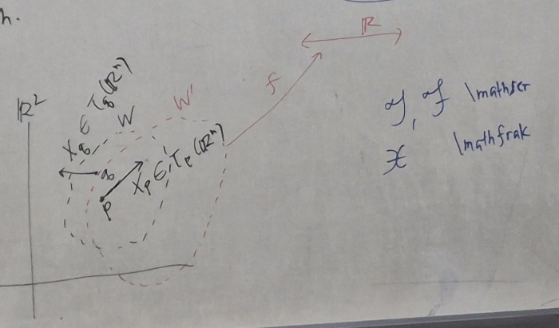

### Theorem: Smoothness is componentwise

There are unique functions $X_i:W\to\mathbb R$ with

$$
X=\sum_i X_i U_i.
$$

The field $X$ is smooth if and only if every $X_i$ is smooth.

**Exercises.** Prove this theorem and show that the natural fields are smooth. For

$$
X=\sin(xy)U_1+\sqrt{x^2+y^2}\,U_2,
$$

determine whether $X$ is smooth on $\mathbb R^2$ and on $\mathbb R^2\setminus\{0\}$.

### Seatwork: Adding and scaling fields

Define $(gX)_p=g(p)X_p$ and $(X+Y)_p=X_p+Y_p$. If $X,Y$ and $g$ are smooth, prove that $gX$ and $X+Y$ are smooth.

**Proof sketch.** For a smooth test function $f$,

$$
(gX)(f)=g\,X(f),\qquad (X+Y)(f)=X(f)+Y(f).
$$

These are products and sums of smooth functions. ∎

## Meeting 4 · January 30: Fields as operators, Lie brackets, and covectors

### Distinguish $hX$ from $Xh$

The expression $hX$ is a **vector field**; $Xh$ is a **real-valued function**, namely $(Xh)(p)=X_p(h)$. For $X=\sum_iX_iU_i$,

$$
X(f)=\sum_iX_i\partial_i f,\qquad X_i=X(x_i).
$$

Thus a smooth field also acts as a map $C^\infty(W)\to C^\infty(W)$.

**Exercises.** Show that $U_i(f)=\partial_i f$ and $P(f)=\sum_i x_i\partial_i f$. Use the component formula to recover $X=\sum_iX(x_i)U_i$ and prove the equivalence between smooth components and smooth action on every local smooth test function.

### Theorem: Calculus rules for fields

For smooth fields $X,Y$, smooth functions $f,g,h$, real constants $a,b$, and smooth $k$ defined near $f(W)$,

$$
\begin{aligned}
X(af+bg)&=aXf+bXg,\\
X(fg)&=(Xf)g+f(Xg),\\
X(k\circ f)&=(k'\circ f)Xf,\\
(fX+gY)(h)&=fXh+gYh.
\end{aligned}
$$

**Exercise.** Derive these from the pointwise tangent-vector rules.

### Definition and exercises: The Lie bracket

Define

$$
[X,Y](f)=X(Yf)-Y(Xf).
$$

This operator corresponds to a smooth vector field, the **Lie bracket**. It measures the failure of the two differentiation operations to commute.

Show that the pointwise operator is a derivation, and establish smoothness either from its action on functions or from its coordinate functions. For calculation, expanding the definition gives

$$
[X,Y]=\sum_i\bigl(X(Y_i)-Y(X_i)\bigr)U_i.
$$

Prove the following identities:

$$
\begin{aligned}
[U_i,U_j]&=0,\\
[X,Y]&=-[Y,X],\\
[aX+bY,Z]&=a[X,Z]+b[Y,Z],\\
[Z,aX+bY]&=a[Z,X]+b[Z,Y],\\
[fX,gY]&=fg[X,Y]+fX(g)Y-gY(f)X.
\end{aligned}
$$

For the last identity, apply both sides to an arbitrary test function and use the product rule. Notice that the bracket is bilinear over real constants but has extra derivative terms for function coefficients.

### Linear-algebra reminder: The dual space

For an $n$-dimensional real vector space $V$, its dual $V^*$ consists of linear maps $V\to\mathbb R$ and also has dimension $n$. A basis $e_1,\ldots,e_n$ determines the dual basis $\phi_i$ by $\phi_i(e_j)=\delta_{ij}$. For example, $\phi_1(ae_1+be_2+ce_3)=a$.

### Definition: Cotangent vectors and the differential of a function

A **cotangent vector** at $p$ is a linear map $T_p\mathbb R^n\to\mathbb R$. Their space is $T_p^*\mathbb R^n$.

For a local smooth function $f$, its **differential** is the covector

$$
df|_p(v_p)=v_p(f).
$$

The covectors $dx_1|_p,\ldots,dx_n|_p$ form the dual natural basis, and

$$
df|_p=\sum_i\partial_i f(p)\,dx_i|_p.
$$

**Seatwork.** Verify linearity and the expansion by evaluating both sides on $u_i|_p$. Distinguish this real-valued covector from the tangent map of $f$, whose target is $T_{f(p)}\mathbb R$; their scalar components agree under the canonical identification.

## Meeting 5 · February 4: One-forms and higher forms

### Exercise with proof: Expanding a covector

For $\theta\in T_p^*\mathbb R^n$, prove

$$
\theta=\sum_i\theta(u_i|_p)\,dx_i|_p.
$$

**Proof.** Expand $\theta=\sum_i a_i dx_i|_p$ in the dual basis. Evaluation on $u_j|_p$ gives $\theta(u_j|_p)=\sum_i a_i\delta_{ij}=a_j$. ∎

### Definition: Covector fields and one-forms

A **covector field** assigns $\Theta_p\in T_p^*\mathbb R^n$ to each point $p$ of an open set $W$. It is smooth, or a **differential one-form**, if $\Theta(X):p\mapsto\Theta_p(X_p)$ is smooth for every smooth local vector field $X$.

Write $\mathfrak X^*(W)$ or $\Omega^1(W)$ for one-forms. Every covector field has a unique expansion

$$
\Theta=\sum_i\Theta_i\,dx_i,
$$

and it is smooth if and only if all $\Theta_i$ are smooth.

**Exercises.** Prove the component criterion, verify that $dx_i$ is smooth, and show that addition and multiplication by smooth functions preserve one-forms. Show that $df$ is a one-form and that $df=\sum_i\partial_i f\,dx_i$.

A one-form acts as a map $\mathfrak X(W)\to C^\infty(W)$. Verify

$$
\begin{aligned}
\Theta(fX+gY)&=f\Theta(X)+g\Theta(Y),\\
(f\Theta+g\Psi)(X)&=f\Theta(X)+g\Psi(X).
\end{aligned}
$$

### Theorem: Rules for differentials

For smooth functions and real constants $a,b$,

$$
\begin{aligned}
d(af+bg)&=a\,df+b\,dg,\\
d(fg)&=g\,df+f\,dg,\\
d(h\circ f)&=(h'\circ f)\,df.
\end{aligned}
$$

A constant function has zero differential, meaning the zero covector at every base point.

### Definition: Differential $k$-forms

For this part, work on an open set $U\subseteq\mathbb R^3$. A **zero-form** is a smooth real-valued function. For $k\ge1$, a **$k$-form** is an alternating map

$$
\omega:\mathfrak X(U)^k\longrightarrow C^\infty(U)
$$

that is $C^\infty(U)$-linear in each slot. Thus, for example,

$$
\omega(fX+gY,X_2,\ldots)=f\omega(X,X_2,\ldots)+g\omega(Y,X_2,\ldots).
$$

For a permutation $\sigma\in S_k$, alternation says

$$
\omega(X_{\sigma(1)},\ldots,X_{\sigma(k)})
=\operatorname{sgn}(\sigma)\,\omega(X_1,\ldots,X_k).
$$

For three slots, the orders $(1,2,3)$, $(2,3,1)$, and $(3,1,2)$ have positive sign; the other three permutations have negative sign. This definition agrees with the earlier definition of a one-form.

## Meeting 6 · February 6: Coordinate forms and wedge products

Write $\Omega^k(U)$ for the collection of $k$-forms; in particular, $\Omega^0(U)=C^\infty(U)$ and $\Omega^1(U)=\mathfrak X^*(U)$.

### Exercises: Addition, scaling, and alternation

Define addition and multiplication by a smooth function by evaluating on arbitrary fields:

$$
\begin{aligned}
(\alpha+\beta)(X_1,\ldots,X_k)&=\alpha(X_1,\ldots,X_k)+\beta(X_1,\ldots,X_k),\\
(f\alpha)(X_1,\ldots,X_k)&=f\,\alpha(X_1,\ldots,X_k).
\end{aligned}
$$

Show these operations preserve $k$-forms. Show also that repeated arguments make an alternating form vanish. Deduce that on $\mathbb R^3$, every $k$-form with $k\ge4$ is zero: expand the arguments in $U_1,U_2,U_3$, and observe that every term has a repeated basis vector.

### Definition and exercises: Wedges of coordinate differentials

Define

$$
(dx_{i_1}\wedge\cdots\wedge dx_{i_k})(V_1,\ldots,V_k)
=\sum_{\sigma\in S_k}\operatorname{sgn}(\sigma)
 \prod_{j=1}^k dx_{i_j}(V_{\sigma(j)}).
$$

Equivalently, this is the determinant of the matrix with entries $dx_{i_j}(V_\ell)$ in row $j$, column $\ell$.

**Exercise.** Reindex using $\sigma^{-1}$ to show that the same expression is

$$
\sum_{\tau\in S_k}\operatorname{sgn}(\tau)
 \prod_{j=1}^k dx_{i_{\tau(j)}}(V_j).
$$

For two slots,

$$
(dx_i\wedge dx_j)(V_1,V_2)
=dx_i(V_1)dx_j(V_2)-dx_i(V_2)dx_j(V_1).
$$

For three slots, the determinant expands into six terms, with the same signs as the six permutations listed in Meeting 5.

Prove that these expressions are $k$-forms, that permuting the coordinate differentials changes the sign by the sign of the permutation, and that a repeated index makes the wedge zero. In three dimensions, any wedge of four or more coordinate differentials vanishes.

### Theorem: Coordinate bases for forms in three dimensions

The following are bases over the smooth functions:

| Degree | Coordinate basis |
|---|---|
| $1$ | $dx,dy,dz$ |
| $2$ | $dy\wedge dz,dz\wedge dx,dx\wedge dy$ |
| $3$ | $dx\wedge dy\wedge dz$ |

Consequently, every one-form, two-form, and three-form has a unique expression of the respective types

$$
\begin{aligned}
\alpha&=f\,dx+g\,dy+h\,dz,\\
\beta&=a\,dy\wedge dz+b\,dz\wedge dx+c\,dx\wedge dy,\\
\gamma&=q\,dx\wedge dy\wedge dz.
\end{aligned}
$$

Here all coefficients are smooth, and $\Omega^k(U)=\{0\}$ for $k\ge4$.

### Definition: Exterior or wedge product

The **wedge product** combines a $k$-form and an $\ell$-form into a $(k+\ell)$-form. It is associative, distributive, agrees with the coordinate wedges above, and satisfies

$$
\alpha\wedge\beta=(-1)^{k\ell}\beta\wedge\alpha.
$$

For a zero-form $f$, wedging is ordinary multiplication: $f\wedge\beta=f\beta$.

**Homework.** Prove that $0_k\wedge\beta=0_{k+\ell}$, where $0_k$ denotes the zero $k$-form.

## Meeting 7 · February 10: Wedge calculations and exterior differentiation

### Useful consequences

Associativity and the degree-zero sign rule give

$$
f(\alpha\wedge\beta)=(f\alpha)\wedge\beta=\alpha\wedge(f\beta).
$$

For the one-form $\alpha=f\,dx+g\,dy+h\,dz$ and the two-form $\beta=a\,dy\wedge dz+b\,dz\wedge dx+c\,dx\wedge dy$, expansion gives

$$
\alpha\wedge\beta=(fa+gb+hc)\,dx\wedge dy\wedge dz.
$$

All terms with repeated coordinate differentials disappear; the remaining cyclic orders have positive sign.

### Exercise revisited: Wedging with zero

The source proof separates the cases of degree zero, total degree at least four, and the remaining degrees in $\mathbb R^3$.

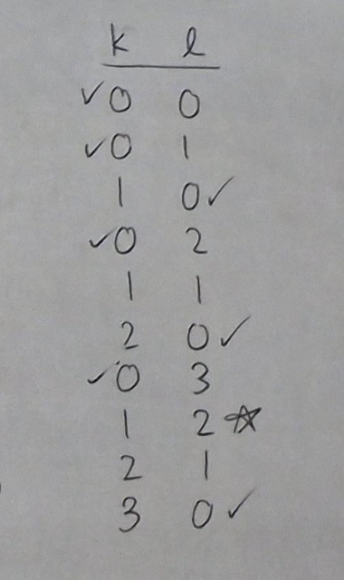

For degree zero, use multiplication by the zero function. For total degree at least four, use the vanishing of all forms in that degree. In the remaining cases, expand in the coordinate bases; every coefficient in the zero form is zero, so the wedge is zero.

### Calculation exercises

Let

$$
\phi=yz\,dx+dz,\qquad
\psi=\sin z\,dx+\cos z\,dy,\qquad
\zeta=dy+z\,dz.
$$

Compute $\phi\wedge\psi$, $\psi\wedge\zeta$, $\zeta\wedge\phi$, and $\phi\wedge\psi\wedge\zeta$.

### Connecting wedges with the cross product

The following maps retain the coefficients while changing the type of object:

$$
\begin{aligned}
\flat(fU_1+gU_2+hU_3)&=f\,dx+g\,dy+h\,dz,\\
\sharp(f\,dx+g\,dy+h\,dz)&=fU_1+gU_2+hU_3,\\
\Phi_1(f\,dx+g\,dy+h\,dz)&=f\,dy\wedge dz+g\,dz\wedge dx+h\,dx\wedge dy.
\end{aligned}
$$

Let $\Phi_2=\Phi_1^{-1}$. Both pairs are inverse $C^\infty(U)$-linear isomorphisms.

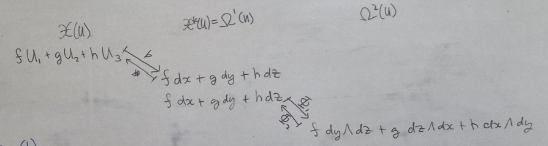

**Exercise.** Show that

$$
V\times W=\sharp\bigl(\Phi_2(\flat V\wedge\flat W)\bigr).
$$

In this sense, the wedge product extends the algebra behind the cross product.

### Definition: Exterior differentiation

The **exterior derivative** maps $k$-forms to $(k+1)$-forms:

$$
d:\Omega^k(U)\longrightarrow\Omega^{k+1}(U).
$$

For a zero-form, it is the usual differential. For a form written in coordinate wedges,

$$
\omega=\sum_I f_I\,dx_{i_1}\wedge\cdots\wedge dx_{i_k},
\qquad
d\omega=\sum_I df_I\wedge dx_{i_1}\wedge\cdots\wedge dx_{i_k}.
$$

So $d$ differentiates the coefficient functions and places their differentials before the coordinate wedge. In particular, $d$ sends $x,y,z$ to $dx,dy,dz$ respectively.

## Meeting 8 · February 13: The identity $d^2=0$ and vector calculus

### Exercises: Rules for exterior differentiation

Prove:

1. If $k\ge3$ in $\mathbb R^3$, then $d\omega=0$ for every $k$-form.
2. A form with constant coordinate coefficients has exterior derivative zero.
3. $d(\alpha+\beta)=d\alpha+d\beta$ for forms of the same degree.
4. For a $k$-form $\alpha$,

$$
d(\alpha\wedge\beta)=d\alpha\wedge\beta+(-1)^k\alpha\wedge d\beta.
$$

### Theorem: Applying $d$ twice gives zero

For every smooth form $\omega$,

$$
d^2\omega=d(d\omega)=0.
$$

**Homework.** Prove the theorem. Equality of mixed partial derivatives and antisymmetry of the wedge product explain the cancellation.

**Calculation exercise.** Compute $d\phi$, $d\psi$, and $d\zeta$ for the three one-forms from Meeting 7.

### Gradient, curl, and divergence

For $V=fU_1+gU_2+hU_3$ and a scalar function $q$, recall

$$
\begin{aligned}
\operatorname{grad}q&=q_xU_1+q_yU_2+q_zU_3,\\
\operatorname{curl}V&=(h_y-g_z)U_1+(f_z-h_x)U_2+(g_x-f_y)U_3,\\
\operatorname{div}V&=f_x+g_y+h_z.
\end{aligned}
$$

Define $\Phi_3(q\,dx\wedge dy\wedge dz)=q$, with inverse $\Phi_0(q)=q\,dx\wedge dy\wedge dz$.

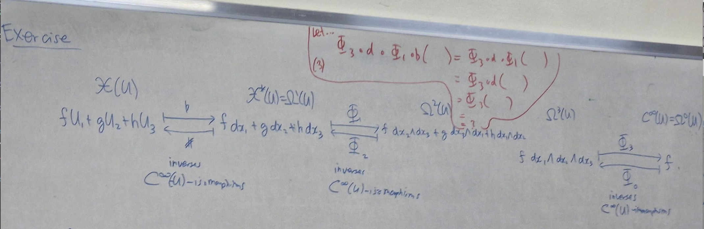

**Exercise.** Verify the operator identities

$$
\begin{aligned}
\operatorname{grad}&=\sharp\circ d,\\
\operatorname{curl}&=\sharp\circ\Phi_2\circ d\circ\flat,\\
\operatorname{div}&=\Phi_3\circ d\circ\Phi_1\circ\flat.
\end{aligned}
$$

Use $d^2=0$ to deduce

$$
\operatorname{curl}(\operatorname{grad}q)=0,
\qquad
\operatorname{div}(\operatorname{curl}V)=0.
$$

The source's final exercise writes “grad composed with curl.” That composition has incompatible input and output types; the second identity above is the corrected statement.

## Meeting 9 · February 18: Smooth curves and velocity

We now apply the language of tangent vectors to motion along a path. A curve is a parametrized map, not merely its image: the parameter records how the path is traversed.

### Review: Intervals, interiors, and boundaries

For finite $a<b$, the four intervals $(a,b)$, $(a,b]$, $[a,b)$, and $[a,b]$ all have interior $(a,b)$ and boundary $\{a,b\}$ in $\mathbb R$.

| Interval | Interior | Boundary |
|---|---|---|
| $(a,\infty)$ or $[a,\infty)$ | $(a,\infty)$ | $\{a\}$ |
| $(-\infty,b)$ or $(-\infty,b]$ | $(-\infty,b)$ | $\{b\}$ |
| $\mathbb R$ | $\mathbb R$ | $\varnothing$ |
| $[a,a]$ | $\varnothing$ | $\{a\}$ |
| $\varnothing$ | $\varnothing$ | $\varnothing$ |

### Definition: Curves and smooth extensions

A **curve** in $\mathbb R^n$ is a continuous map $\alpha:I\to\mathbb R^n$, where $I$ is an interval with nonempty interior. A **curve segment** has a closed bounded interval as its domain.

For open $I$, the curve is **smooth** when its component functions are smooth.

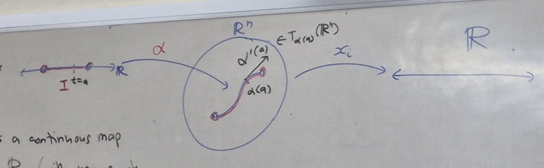

For a non-open interval, smoothness means that $\alpha$ extends to a smooth curve on an open interval containing $I$.

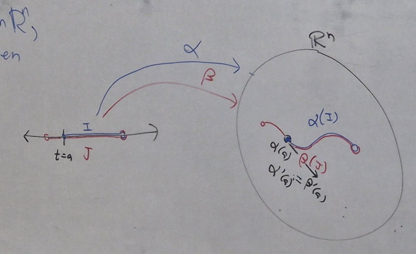

### Exercises: Localizing and restricting a curve

Let $a\in I$ and let $V$ be an open neighborhood of $\alpha(a)$.

1. If $a\in I^\circ$, show that there is an open interval $J$ with $a\in J\subseteq I^\circ$ and $\alpha(J)\subseteq V$.
2. If $a=\inf I$ belongs to $I$, find $b>a$ such that $[a,b)\subseteq I$ and $\alpha([a,b))\subseteq V$. Give the analogous statement at an included right endpoint.
3. Prove that having a smooth curve extension is equivalent to having a smooth extension in the earlier sense. For the latter direction, use the interval component of the extension's open domain containing $I$.
4. Show that restriction to any subinterval with nonempty interior preserves smoothness. Deduce smooth versions of parts 1 and 2.

### Definition: Velocity

For an interior parameter value $a$, the **velocity** is the tangent vector

$$
\alpha'(a)=\sum_{i=1}^n\frac{d\alpha_i}{dt}(a)\,u_i|_{\alpha(a)}
=\left(\alpha_1'(a),\ldots,\alpha_n'(a)\right)_{\alpha(a)}.
$$

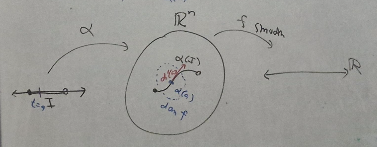

Its vector part is the componentwise derivative, but its base point is $\alpha(a)$. For $n=1$, distinguish the velocity vector from its real-valued derivative component.

**Exercise.** Show that

$$
\alpha'(a)=\alpha_*|_a(u_1|_a),
$$

where $u_1|_a$ belongs to the one-dimensional parameter tangent space $T_a\mathbb R$.

### Endpoint velocities

If $a\in I\cap\partial I$, define $\alpha'(a)$ using any smooth extension. This is well-defined.

**Exercises.** At an included left endpoint, show that every smooth extension $\beta$ satisfies

$$
\beta_i'(a)=\lim_{t\to a^+}\alpha_i'(t).
$$

Use the analogous left-hand limit at a right endpoint. Deduce that two extensions have identical velocities there. If an endpoint is excluded from $I$, it is not automatically a parameter value of the curve; an extension must actually include that endpoint before its derivative there can be discussed.

An **initial velocity** means a velocity at parameter $0$, when $0\in I$. A smooth curve is **regular** if its velocity is nonzero at every parameter value.

### Exercises: Basic curves

1. Show that a smooth curve is constant if and only if its velocity vanishes everywhere.
2. For $\alpha(t)=p+tv$, calculate the velocity and initial velocity. If $v\ne0$, this is a regular line; if $v=0$, it is constant.
3. For $a>0$ and $b\ne0$, calculate the velocity of the helix $\alpha(t)=(a\cos t,a\sin t,bt)$.
4. For the circle $\alpha:[0,2\pi]\to\mathbb R^3$, $\alpha(t)=(a\cos t,a\sin t,0)$, use the extension with the same formula on $\mathbb R$ to compute and compare $\alpha'(0)$ and $\alpha'(2\pi)$.
5. Show that $(\alpha|_J)'=\alpha'|_J$ for a subinterval $J$ with nonempty interior.

### Theorem: Velocity differentiates along a curve

For a smooth local function $f$ near $\alpha(a)$,

$$
\alpha'(a)(f)=\left.\frac{d}{dt}(f\circ\alpha)(t)\right|_{t=a}.
$$

**Exercise.** Prove this using the tangent map. More generally, for a smooth map $f:V\to\mathbb R^m$ and a sufficiently small interval $J$ with $\alpha(J)\subseteq V$, set $\beta=f\circ\alpha|_J$ and show

$$
\beta'(a)=f_*|_{\alpha(a)}\bigl(\alpha'(a)\bigr).
$$

This gives a geometric interpretation of $f_*$: choose a curve with initial velocity $v_p$, compose the curve with $f$, and take its initial velocity. The resulting vector is $f_*|_p(v_p)$.

## Meeting 9.5 · February 19: Reading assignment on curves and fields

### Proof: Constant curves and zero velocity

If all component functions of $\alpha$ are constant, their derivatives vanish. Conversely, if $\alpha'=0$, then every $\alpha_i'$ vanishes on the interior interval. Each $\alpha_i$ is constant there, and continuity extends those same values to any included endpoints. Thus $\alpha$ is constant. ∎

### Examples: Lines, helices, and the 3-curve

The line and helix have velocities

$$
\begin{aligned}
\alpha(t)=p+tv&\quad\Longrightarrow\quad\alpha'(t)=v_{\alpha(t)},\\
\alpha(t)=(a\cos t,a\sin t,bt)
&\quad\Longrightarrow\quad\alpha'(t)=(-a\sin t,a\cos t,b)_{\alpha(t)}.
\end{aligned}
$$

The source calls the following the **3-curve**:

$$
\alpha(t)=(3t-t^3,3t^2,2t+t^3).
$$

Differentiating the curve as written gives

$$
\alpha'(t)=(3-3t^2,6t,2+3t^2)_{\alpha(t)}.
$$

The source prints $3+3t^2$ for the last component; here it is corrected to agree with the displayed curve $2t+t^3$.

### Definition: Reparametrization

Following the source's convention, if $f:J\to I$ is continuous and nondecreasing, then $\beta=\alpha\circ f$ is a **positive reparametrization**; if $f$ is nonincreasing, it is a **negative reparametrization**. When both maps are smooth, the reparametrization is smooth.

This convention allows pauses and does not require $f$ to be onto. To traverse exactly the same path with a regular change of parameter, stronger conditions, such as a smooth bijection with nonzero derivative, are needed.

### Theorem: Velocity under reparametrization

At interior parameter values where the composition is defined,

$$
\beta'(a)=f'(a)\,\alpha'(f(a)).
$$

The scalar factor changes the speed; a negative factor reverses the direction.

### Exercise with solution: Scaling velocity

Given $k\ne0$, construct a bijective change of parameter with $\beta'(a)=k\alpha'(f(a))$.

Take $f(t)=kt$ on $J=\{t:kt\in I\}$. This is a smooth bijection $J\to I$, with inverse $s\mapsto s/k$. The chain rule gives

$$
\beta'(a)=f'(a)\alpha'(f(a))=k\alpha'(f(a)).
$$

### Definition: Vector fields along a curve

A **vector field along $\alpha$** assigns $X_t\in T_{\alpha(t)}\mathbb R^n$ to each parameter $t$. The assignment is indexed by the parameter, so two visits to the same point need not give the same field value.

Examples are the natural fields $U_i(\alpha)$, the zero field, the position field $P(\alpha)_t=\alpha(t)_{\alpha(t)}$, and, for a smooth curve, its velocity field $\alpha'$.

An ambient field $X$ on $V$ restricts along any part of the curve in $V$ by $t\mapsto X_{\alpha(t)}$. Define addition and scalar multiplication pointwise:

$$
(X+Y)_t=X_t+Y_t,\qquad (fX)_t=f(t)X_t.
$$

### Theorem: Smooth fields along curves

Every field has unique coordinate functions $X_i:I\to\mathbb R$ satisfying

$$
X=\sum_i X_iU_i(\alpha).
$$

Call it smooth when these functions are smooth, and write $\mathfrak X(\alpha)$ for these fields. If $\alpha$ is smooth, this is equivalent to requiring that, for every smooth local test function $f$,

$$
X(f):t\mapsto X_t(f)
$$

is smooth on the relevant part of $\alpha^{-1}(\operatorname{dom}f)$.

For an arbitrary continuous curve, the test-function condition implies smooth coordinate functions by testing $x_i$. The converse needs the smoothness of $\alpha$.

### Exercises and supplied proof arguments

1. Show that all $U_i(\alpha)$ have smooth coordinates.
2. Show that $P(\alpha)$ has smooth coordinates if and only if $\alpha$ is smooth.
3. Show that restricting a smooth ambient field along a smooth curve produces a smooth field along that curve.
4. Prove that the velocity field of a smooth curve is smooth. Its action on $f$ is $d(f\circ\alpha)/dt$, a smooth function.
5. Prove again that $P(\alpha)$ is smooth when $\alpha$ is smooth, using

$$
P(\alpha)(f)=\sum_i\alpha_i(t)\,\partial_i f(\alpha(t)).
$$

6. Show that sums and smooth scalar multiples of smooth fields along $\alpha$ are smooth. On a test function $q$, use $(fX)(q)=fX(q)$ and $(X+Y)(q)=X(q)+Y(q)$.

### Theorem: Directional derivatives along a curve

For a field $X=\sum_iX_iU_i(\alpha)$ and a smooth local function $f$,

$$
X(f)=\sum_iX_i(\partial_i f\circ\alpha),\qquad
X_i=X(x_i).
$$

In particular,

$$
U_i(\alpha)(f)=\partial_i f\circ\alpha,\qquad
P(\alpha)(f)=\sum_i\alpha_i(\partial_i f\circ\alpha).
$$

For real constants $a,b$, scalar coefficient functions $r,s$ on $I$, and suitable smooth test functions,

$$
\begin{aligned}
X(af+bg)&=aX(f)+bX(g),\\
X(fg)&=X(f)(g\circ\alpha)+(f\circ\alpha)X(g),\\
X(h\circ f)&=(h'\circ f\circ\alpha)X(f),\\
(rX+sY)(f)&=rX(f)+sY(f).
\end{aligned}
$$

A constant test function has derivative zero. **Exercise.** Prove these rules pointwise; observe the compositions with $\alpha$ in the product and chain rules.

## Meeting 10 · February 20: The Euclidean metric

Until now, derivatives have not required a notion of length. The metric supplies lengths, angles, and orthogonality in each tangent space.

### Definition: The standard Riemannian metric

The **Euclidean Riemannian metric** is the assignment

$$
g_p(v_p,w_p)=v\cdot w.
$$

The notes use this particular metric on $\mathbb R^n$; a general Riemannian metric need not have constant coefficients.

### Exercises: Inner-product properties

Prove that $g_p$ is bilinear, symmetric, positive-definite, and nondegenerate. Explicitly,

$$
\begin{aligned}
g_p(v_p,w_p)&=\sum_i v_p(x_i)w_p(x_i),\\
g_p(v_p,v_p)&\ge0,\quad\text{with equality precisely when }v_p=0_p,\\
g_p(v_p,w_p)=0\text{ for every }w_p&\quad\Longrightarrow\quad v_p=0_p.
\end{aligned}
$$

For fields on an open set, define $g(X,Y)(p)=g_p(X_p,Y_p)$. Show that $g(X,Y)=\sum_iX_iY_i$ is smooth when $X,Y$ are smooth, and that this operation is symmetric and $C^\infty(W)$-bilinear. Prove the analogous statements for fields along a smooth curve.

### Exercise with proof: Writing the metric as a tensor

Define $(dx_i\otimes dx_j)(X,Y)=dx_i(X)dx_j(Y)$. Show that

$$
g=\sum_i dx_i\otimes dx_i.
$$

**Proof.** Since $dx_i|_p(u_j|_p)=\delta_{ij}$, expansion in the natural basis gives $dx_i(X)=X_i$. Hence

$$
\left(\sum_i dx_i\otimes dx_i\right)(X,Y)
=\sum_i X_iY_i=g(X,Y).
$$

This holds for arbitrary fields, proving the identity. ∎

The tensor product here is not the wedge product: the metric is symmetric, whereas a differential two-form is alternating.

Using $dx_i^2$ as shorthand for $dx_i\otimes dx_i$, write $g=dx_1^2+\cdots+dx_n^2$. The source also notes the Lorentzian metric of index one,

$$
-dx_1^2+dx_2^2+\cdots+dx_n^2,
$$

whose four-dimensional version is the flat metric used in special relativity. It is not positive-definite.

### Definition and exercises: Distance, norm, and angle

At a fixed base point, define

$$
\|v_p\|=\sqrt{g_p(v_p,v_p)},\qquad
 d_p(v_p,w_p)=\sqrt{g_p(v_p-w_p,v_p-w_p)}.
$$

Show that $d_p(v_p,w_p)$ equals the usual Euclidean distance between $v$ and $w$, and hence is a metric on $T_p\mathbb R^n$. A vector of norm one is a **unit vector**.

Vectors are **orthogonal** when $g_p(v_p,w_p)=0$. For nonzero vectors their angle is the unique $\theta\in[0,\pi]$ with

$$
\cos\theta=\frac{g_p(v_p,w_p)}{\|v_p\|\,\|w_p\|}.
$$

Cauchy-Schwarz guarantees that the right-hand side lies in $[-1,1]$. These definitions apply pointwise to fields, including fields along a curve.

### Definition: Cross product

For $v,w\in T_p\mathbb R^3$, define the cross product by the formal determinant

$$
v\times w=
\begin{vmatrix}
u_1|_p&u_2|_p&u_3|_p\\
v(x_1)&v(x_2)&v(x_3)\\
w(x_1)&w(x_2)&w(x_3)
\end{vmatrix}.
$$

Recall from vector analysis:

$$
\begin{aligned}
v\times w&\perp v,w,\\
\|v\times w\|^2&=\|v\|^2\|w\|^2-g_p(v,w)^2,\\
\|v\times w\|&=\|v\|\|w\|\sin\theta\quad(v,w\ne0).
\end{aligned}
$$

Cross products of fields are defined pointwise.

### Exercise and definition: Metric equivalence

Show that $g(U_i,\,\cdot\,)=dx_i$. For a smooth field $X$, define

$$
X^\flat=g(X,\,\cdot\,).
$$

Show that this is the earlier coefficient map $\flat$, and that its inverse is $\sharp$. If $\Theta=X^\flat$, equivalently $X=\Theta^\sharp$, then $X$ and $\Theta$ are **metrically equivalent**.

## Meeting 11 · February 27: Arc length and differentiation along a curve

### Definition: Speed and length

For a smooth curve $\alpha:I\to\mathbb R^n$, its **speed** at an included parameter $t$ is

$$
\nu(t)=\|\alpha'(t)\|
=\sqrt{g_{\alpha(t)}(\alpha'(t),\alpha'(t))}
=\sqrt{\sum_i(\alpha_i'(t))^2}.
$$

The curve is **unit speed** if $\nu\equiv1$. Its **length** is

$$
L(\alpha)=\int_I\nu(t)\,dt\in[0,\infty].
$$

For $a<b$ in $I$, the length from $a$ to $b$ is $\int_a^b\nu(t)\,dt$. At excluded endpoints or on unbounded intervals, interpret length using the relevant improper limit. Finite-length curves are **rectifiable**.

A speed at an excluded endpoint is not presumed to exist. Also, the signed integral with reversed limits is negative, whereas geometric length is nonnegative.

### Exercises: Recognizing unit speed

1. Derive the component formula for speed. For $n=1$, verify that it is the absolute value of the ordinary derivative.
2. For $a>0$ and $c\ne0$, show that $(a\cos(t/c),a\sin(t/c),0)$ is unit speed exactly when $|c|=a$.
3. For $a>0$ and $b,c\ne0$, show that $(a\cos(t/c),a\sin(t/c),bt/c)$ is unit speed exactly when $|c|=\sqrt{a^2+b^2}$.
4. Compare the positive and negative choices of $c$ in both examples.

### Theorem: Constant speed and length

If the speed is the constant $k\ge0$, the length over $[a,b]$ with $a<b$ is $k(b-a)$. **Exercise.** Prove this by integration, including limiting versions when appropriate.

### Theorem: Arc-length reparametrization

Let $\alpha:I\to\mathbb R^n$ be regular on an open interval, and fix $a\in I$. Define

$$
s(t)=\int_a^t\|\alpha'(\lambda)\|\,d\lambda.
$$

Then $s$ is a smooth increasing bijection onto the open interval $J=s(I)$, with smooth inverse $f:J\to I$. The curve

$$
\beta=\alpha\circ f
$$

has unit speed and is the positive arc-length reparametrization based at $a$. This normalization determines $f$ uniquely. For $b<c$ in $J$, its length from $b$ to $c$ is $c-b$.

**Proof.** Since $\alpha$ is regular, $s'(t)=\|\alpha'(t)\|>0$. Thus $s$ is strictly increasing, and the inverse function theorem gives a smooth inverse on its image. Moreover,

$$
f'(s)=\frac1{\|\alpha'(f(s))\|}>0.
$$

The chain rule gives

$$
\|\beta'(s)\|=f'(s)\|\alpha'(f(s))\|=1.
$$

The length statement follows by integrating one. ∎

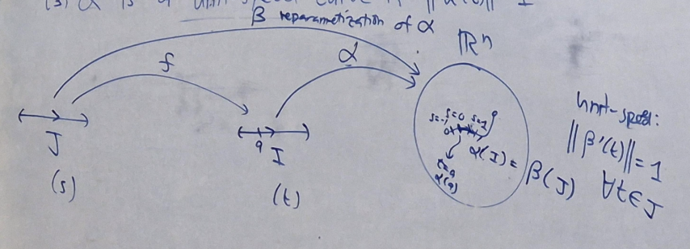

### Worked exercise: A line

For $\alpha(t)=p+tv$ with $v\ne0$, choose base time $b$. Its speed is $\|v\|$, so

$$
\begin{aligned}
s(t)&=\|v\|(t-b),\\
f(s)&=b+\frac{s}{\|v\|},\\
\beta(s)&=(p+bv)+s\frac{v}{\|v\|}.
\end{aligned}
$$

The new direction vector has length one, and $\beta(0)=\alpha(b)$.

### Worked exercise: A helix

For $\alpha(t)=(a\cos t,a\sin t,bt)$ with $a>0$, $b\ne0$, use base point $(a,0,0)$. This corresponds to $t=0$, since $bt=0$ forces $t=0$. Put $c=\sqrt{a^2+b^2}$. Then

$$
\begin{aligned}
\alpha'(t)&=(-a\sin t,a\cos t,b)_{\alpha(t)},\\
\|\alpha'(t)\|&=\sqrt{a^2\sin^2t+a^2\cos^2t+b^2}=c,\\
s(t)&=ct,\qquad f(s)=s/c,\\
\beta(s)&=\left(a\cos\frac sc,a\sin\frac sc,\frac{bs}{c}\right).
\end{aligned}
$$

### Definition: Covariant derivative along a curve

For a smooth curve and a smooth field $X=\sum_iX_iU_i(\alpha)$ along it, define

$$
X'=\frac{dX}{dt}=\sum_i\frac{dX_i}{dt}U_i(\alpha).
$$

This is the Euclidean **covariant derivative along the curve**. We differentiate vector components and retain the current base point.

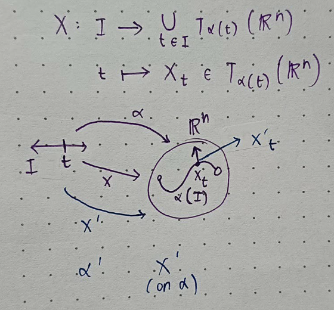

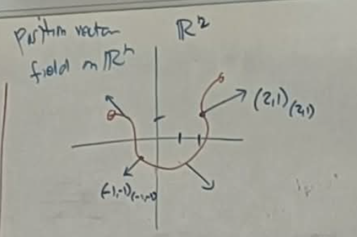

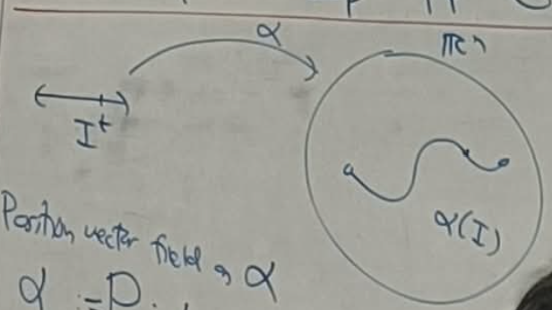

### Exercises: Basic covariant derivatives

1. Show that $X'$ is smooth whenever $X$ is smooth.
2. Compute $U_i(\alpha)'$.
3. Show that $P(\alpha)'=\alpha'$, also written $(\alpha_\alpha)'=\alpha'$.
4. Compute $(\alpha')'$ by differentiating the velocity components.
5. For a smooth ambient field $X=\sum_iX_iU_i$ defined near the relevant curve segment, show

$$
\bigl(X(\alpha|_J)\bigr)'
=\sum_i(\alpha|_J)'(X_i)\,U_i(\alpha|_J).
$$

Here the coefficients are directional derivatives of the ambient component functions along the velocity.

### Theorem: Differentiation rules along a curve

For real constants $a,b$, smooth scalar $f$, and smooth fields $X,Y$ along $\alpha$,

$$
\begin{aligned}
(aX+bY)'&=aX'+bY',\\
(fX)'&=f'X+fX',\\
\frac{d}{dt}g(X,Y)&=g(X',Y)+g(X,Y').
\end{aligned}
$$

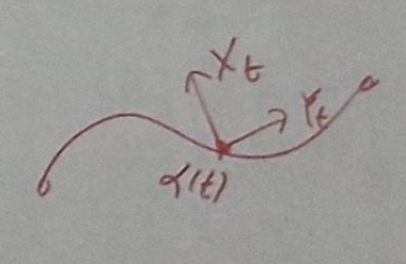

### Exercises and proof: Constant inner products and orthogonality

If $g(X,Y)$ is constant, its derivative is zero. The last rule therefore gives

$$
g(X',Y)=-g(X,Y').
$$

Taking $Y=X$ shows that a constant-length field is orthogonal to its derivative. Apply this to $X=\alpha'$ to prove that a constant-speed curve has

$$
\alpha'\perp\alpha''.
$$

This is the orthogonality used later to construct the Frenet frame.

## Meeting 12 · March 5: Parallel fields, geodesics, and directional covariant derivatives

### Definition: Acceleration

The **acceleration** is the covariant derivative of velocity:

$$
\alpha''=(\alpha')'
=(\alpha_1'',\ldots,\alpha_n'')_\alpha.
$$

Recall that covariant differentiation is real-linear, obeys $(fX)'=f'X+fX'$, and annihilates fields with constant vector part.

### Definition and exercises: Parallel fields

A field is **parallel along $\alpha$** if $X'=0$. In Euclidean coordinates,

$$
X'=0\quad\Longleftrightarrow\quad X_i'=0\text{ for every }i
\quad\Longleftrightarrow\quad\text{all vector components are constant}.
$$

**Exercises.** Derive this system of ordinary differential equations. Show that $P(\alpha)$ is parallel if and only if $\alpha$ is constant.

### Definition and exercises: Geodesics

A smooth curve in Euclidean space is a **geodesic** if $\alpha''=0$, equivalently if its velocity is parallel. The component equations are

$$
\alpha_i''=0\quad(i=1,\ldots,n).
$$

Solving them on the interval gives

$$
\alpha(t)=p+tv
$$

for constant $p,v$. Conversely, every curve of this form has zero acceleration. This includes constant curves when $v=0$.

**Exercises.** Check both directions. A line traced with an arbitrary nonlinear parameter need not be a geodesic with that parameter; the zero-acceleration condition includes the parametrization.

### Definition: Covariant derivative in a tangent direction

For $v_p=(p;v)$ and a smooth field $X$ near $p$, follow the line $t\mapsto p+tv$ and define

$$
\nabla_{v_p}X
=\left.\frac{d}{dt}\bigl(X(p+tv)\bigr)\right|_{t=0}
\in T_p\mathbb R^n.
$$

The derivative here is the covariant derivative of a field along that line.

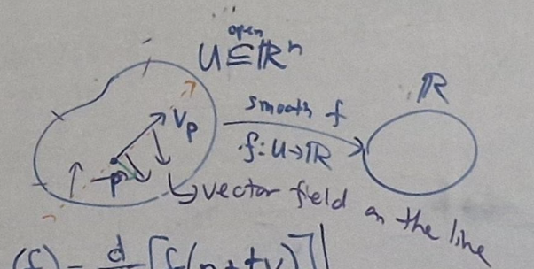

Compare with $v_p(f)=\left.\frac{d}{dt}f(p+tv)\right|_{t=0}$. The new operation differentiates a vector field rather than a scalar function.

## Meeting 13 · March 7: The Euclidean Levi-Civita connection

### Exercises: Compute from the definition

For

$$
p=(2,1,0),\qquad v=(-1,0,2),\qquad
X=x^2U_1+yzU_3,
$$

compute $\nabla_{v_p}X$ using the line through $p$ in direction $v$.

For the exercise labeled $(\star)$, take

$$
p=(1,3,-1),\qquad v=(1,-1,2)_p,\qquad
A=x^2U_1+x^2U_2-z^2U_3.
$$

Compute $\nabla_vA$ by definition. The source also asks for $\nabla_vB$, but does not define $B$; that part cannot be completed from the supplied material.

### Theorem: Coordinate formula at a point

If $X=\sum_iX_iU_i$ near $p$ and $v\in T_p\mathbb R^n$, then

$$
\nabla_vX=\sum_i v(X_i)u_i|_p.
$$

**Exercise.** Derive the formula from the line definition and the scalar directional-derivative formula.

### Theorem: Rules at a point

For $v,w\in T_p\mathbb R^n$, constants $a,b$, smooth local fields $X,Y$, and a local smooth function $f$,

$$
\begin{aligned}
\nabla_{av+bw}X&=a\nabla_vX+b\nabla_wX,\\
\nabla_v(aX+bY)&=a\nabla_vX+b\nabla_vY,\\
\nabla_v(fX)&=v(f)X_p+f(p)\nabla_vX,\\
v\bigl(g(X,Y)\bigr)
&=g_p(\nabla_vX,Y_p)+g_p(X_p,\nabla_vY).
\end{aligned}
$$

**Exercise.** Prove these from the coordinate formula. Distinguish $X'$, a field along a curve, from $\nabla_vX$, a single tangent vector.

### Definition: The Levi-Civita connection

The Euclidean **Levi-Civita connection** assigns to smooth fields $X,Y$ a smooth field $\nabla_XY$ by

$$
(\nabla_XY)_p=\nabla_{X_p}Y.
$$

It is defined on $\mathbb R^n$ or on any open subset $W$ on which the fields are defined.

### Theorem $(\circ)$: Coordinate formula for the connection

If $Y=\sum_iY_iU_i$, then

$$
\nabla_XY=\sum_iX(Y_i)U_i.
$$

In ordinary words, differentiate each component of $Y$ in the direction specified by $X$.

### Theorem $(\heartsuit)$: Connection rules

For smooth fields $X,Y,Z$, smooth functions $f,h$, and real constants $a,b$,

$$
\begin{aligned}
\nabla_{fX+hY}Z&=f\nabla_XZ+h\nabla_YZ,\\
\nabla_X(aY+bZ)&=a\nabla_XY+b\nabla_XZ,\\
\nabla_X(fY)&=X(f)Y+f\nabla_XY,\\
X\bigl(g(Y,Z)\bigr)&=g(\nabla_XY,Z)+g(Y,\nabla_XZ).
\end{aligned}
$$

The first argument is linear over smooth functions; the second argument instead obeys a product rule. Here $v(f)$ at a point is a real number, whereas $X(f)$ is a function.

**Exercises.** Show that $\nabla_XU_i=0$. Revisit the defined part of exercise $(\star)$ using the coordinate formula $(\circ)$ and then the rules $(\heartsuit)$.

## Meeting 14 · March 11: Covariant differentiation practice

Recall $U_i(f)=\partial_i f$ and the formula $(\circ)$ above.

### Exercise: Differentiating two fields in each other's directions

Let

$$
X=x^2U_1+yzU_3,\qquad
Y=(y-x)U_1+xyU_3.
$$

Compute $\nabla_XY$ and $\nabla_YX$. Use $X$ and $Y$ as differential operators on each other's coefficient functions.

### Exercise: Applying the connection rules

Let

$$
V=-yU_1+xU_3,\qquad W=\cos x\,U_1+\sin x\,U_2.
$$

Compute:

1. $\nabla_VW$.
2. $\nabla_VV$.
3. $\nabla_V(z^2W)$.
4. $\nabla_WV$.
5. $\nabla_V(\nabla_VW)$.
6. $\nabla_V(xV-zW)$, using the results of parts 1 and 2.

These exercises complete the Unit I material supplied. The same differentiation rules will control how the tangent, normal, and binormal vectors change in Unit II.

## Editorial notes and source limits

The definitions, theorem statements, exercises, and supplied proof arguments above follow the attached Unit I PDF and Typst source. Repeated recaps are combined; original date and meeting labels are retained. Blank proof boxes remain exercises, and prose explanations connect the material.

The following apparent transcription errors or domain issues have been corrected explicitly:

- Boundary points are allowed outside the set; the relative-openness criterion quantifies over points of $V$.
- The smooth-composition proof uses the open set $\widetilde f^{-1}(\widetilde B)$ and image containment, not an unjustified equality with the codomain.
- The tangent-vector product rule evaluates scalar functions at the base point.
- The two-form basis contains all three distinct cyclic coordinate wedges; the source corollary repeats one and omits another.
- The vector-calculus identity is $\operatorname{div}\circ\operatorname{curl}=0$; $\operatorname{grad}\circ\operatorname{curl}$ is not a defined composition here.
- The printed 3-curve is retained, and its last velocity component is corrected to $2+3t^2$.
- Speed includes the square root of the metric pairing. Length formulas are stated for ordered endpoints, with improper limits distinguished from endpoint velocities.
- The metric's tensor product is distinguished from an alternating two-form, and missing coefficients in the covariant-derivative rules are restored.
- The field $B$ in exercise $(\star)$ is undefined in the supplied source. Two “insert image” placeholders and a trailing isolated union expression also have no supplied explanatory content; no missing material is invented.

All 28 actual illustrations are retained. Their original filenames skip figures 17-19; no such images were embedded in the supplied PDF.
