# Math 146: Differential Geometry, Unit II

**Course notes:** Isaiah John L. Mariano, III – BS Mathematics  
**Professor:** Jade Ventura  
**Original template:** Jeremiah Daniel A. Regalario

These notes cover Meetings 14–20, from March 11 to May 6, following the supplied lecture notes. The source labels both April 24 and April 29 as Meeting 19; the dates distinguish them here. Its May 8 section contains only an opening sentence.

We begin with moving orthonormal bases, use them to measure how curves bend and twist, and then turn to surfaces and their tangent vectors. Repeated reminders are consolidated, while the exercises and supplied proof arguments are retained. Blank proof spaces remain exercises. Brief explanations and clearly identified corrections help connect the material.

**Notation.** The Euclidean inner product is $g_p(v,w)=v\cdot w$ at a point $p$. For vector fields, $g(X,Y)$ means the pointwise inner product. The natural coordinate fields are $U_1,\ldots,U_n$. A prime means differentiation with respect to the displayed parameter: $s$ for unit-speed curves and $t$ for general parametrizations.

## Meeting 14 · March 11: Frames and frame fields

### Definition: Orthogonal and orthonormal frames

An **orthogonal frame** at $p\in\mathbb R^n$ consists of $n$ nonzero vectors $e_1,\ldots,e_n\in T_p\mathbb R^n$ satisfying

$$
g_p(e_i,e_j)=0\qquad(i\ne j).
$$

It is **orthonormal** if each vector also has length one. Equivalently,

$$
g_p(e_i,e_j)=\delta_{ij}.
$$

Think of a frame as a choice of coordinate directions at a point. Orthogonality makes those directions perpendicular; normalization gives them a common unit scale.

### Definition: Frame fields

On an open set $W\subseteq\mathbb R^n$, an **orthogonal frame field** consists of smooth vector fields $E_1,\ldots,E_n$ whose values form an orthogonal frame at every point. It is **orthonormal** when the pointwise frames are orthonormal.

The nonzero requirement matters: pairwise orthogonality alone would allow a zero vector, which cannot be a basis vector.

### Example: The natural frame

The coordinate fields

$$
U_i|_p=(0,\ldots,1,\ldots,0)_p,\qquad i=1,\ldots,n,
$$

form an orthonormal frame field on $\mathbb R^n$. In the plane these are the fixed horizontal and vertical unit directions. A moving frame may instead rotate from point to point.

### Theorem: Expansion in an orthonormal frame

If $e_1,\ldots,e_n$ is an orthonormal frame at $p$, it is a basis of $T_p\mathbb R^n$. For any $v,w\in T_p\mathbb R^n$,

$$
\begin{aligned}
v&=\sum_{i=1}^n g_p(v,e_i)e_i,\\
g_p(v,w)&=\sum_{i=1}^n g_p(v,e_i)g_p(w,e_i).
\end{aligned}
$$

**Exercise.** Prove both identities. The coefficient $g_p(v,e_i)$ is the component of $v$ in the $e_i$ direction.

### Theorem: Expansion of vector fields

For an orthonormal frame field $E_1,\ldots,E_n$ on $W$ and smooth fields $X,Y$,

$$
\begin{aligned}
X&=\sum_{i=1}^n g(X,E_i)E_i,\\
g(X,Y)&=\sum_{i=1}^n g(X,E_i)g(Y,E_i).
\end{aligned}
$$

These are pointwise identities. The coefficients are smooth functions, rather than necessarily constant scalars.

**Exercise.** Deduce this result from the preceding theorem at each point of $W$.

### Example: The polar frame field

On $W=\mathbb R^2\setminus\{0\}$, write $r=\sqrt{x^2+y^2}>0$. Define

$$
\begin{aligned}
E_r&=\cos\theta\,U_1+\sin\theta\,U_2
    =\frac{x}{r}U_1+\frac{y}{r}U_2,\\
E_\theta&=-\sin\theta\,U_1+\cos\theta\,U_2
    =-\frac{y}{r}U_1+\frac{x}{r}U_2.
\end{aligned}
$$

Although an angle $\theta$ cannot be chosen continuously on the whole punctured plane, the expressions involving $x/r$ and $y/r$ define smooth fields everywhere on $W$.

Here $E_r$ points outward and $E_\theta$ points counterclockwise along a circle centered at the origin. To check orthonormality,

$$
\begin{aligned}
g(E_r,E_\theta)
&=(\cos\theta)(-\sin\theta)+(\sin\theta)(\cos\theta)=0,\\
g(E_r,E_r)&=\cos^2\theta+\sin^2\theta=1,\\
g(E_\theta,E_\theta)&=\sin^2\theta+\cos^2\theta=1.
\end{aligned}
$$

At $p=(\sqrt3/2,1/2)$, the radial vector makes angle $\pi/6$ with the positive horizontal axis.

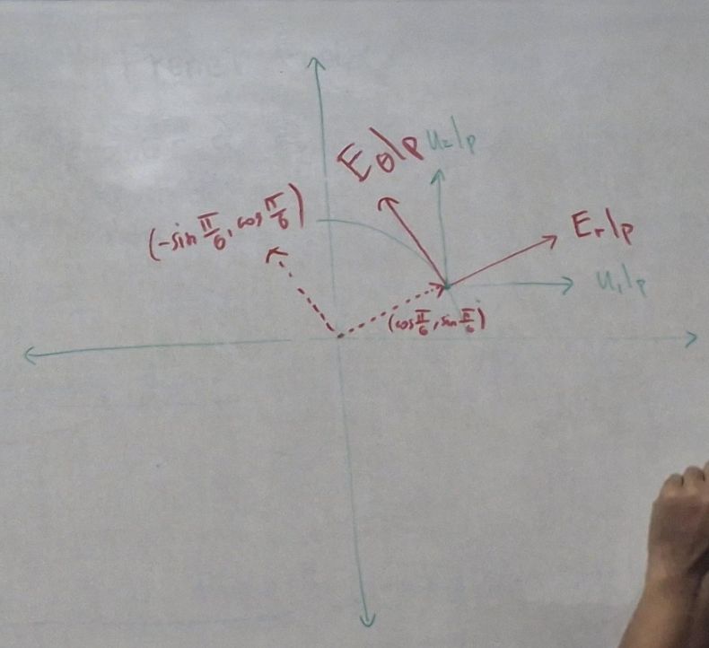

## Meeting 15 · March 13: Moving frames and curvature

### Polar, cylindrical, and spherical directions

The notation $\mathbb R^2_{r>0}$ means the punctured plane. In $\mathbb R^3$, the notation $\mathbb R^3_{r>0}$ means $x^2+y^2>0$, so the entire $z$-axis is excluded.

The polar fields from Meeting 14 point in the directions of increasing $r$ and increasing $\theta$.

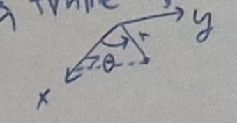

The **cylindrical frame** on $\mathbb R^3_{r>0}$ is

$$
\begin{aligned}
E_r&=\cos\theta\,U_1+\sin\theta\,U_2,\\
E_\theta&=-\sin\theta\,U_1+\cos\theta\,U_2,\\
E_z&=U_3.
\end{aligned}
$$

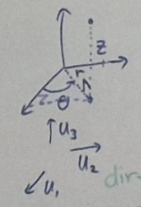

### Exercise: The spherical frame

Use $\rho$ for distance from the origin and $\varphi$ for **elevation above the horizontal plane**. This convention is important: some books use the angle measured from the positive $z$-axis instead.

Define

$$
\begin{aligned}
F_\rho&=\cos\varphi\,E_r+\sin\varphi\,E_z,\\
F_\theta&=E_\theta,\\
F_\varphi&=-\sin\varphi\,E_r+\cos\varphi\,E_z.
\end{aligned}
$$

1. Express these three fields in terms of $U_1,U_2,U_3$.
2. Show that they form an orthonormal frame field on $\mathbb R^3_{r>0}$.
3. Identify the directions of increasing $\rho$, $\theta$, and $\varphi$ in the illustrations.

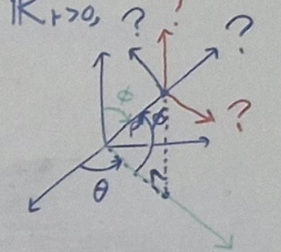

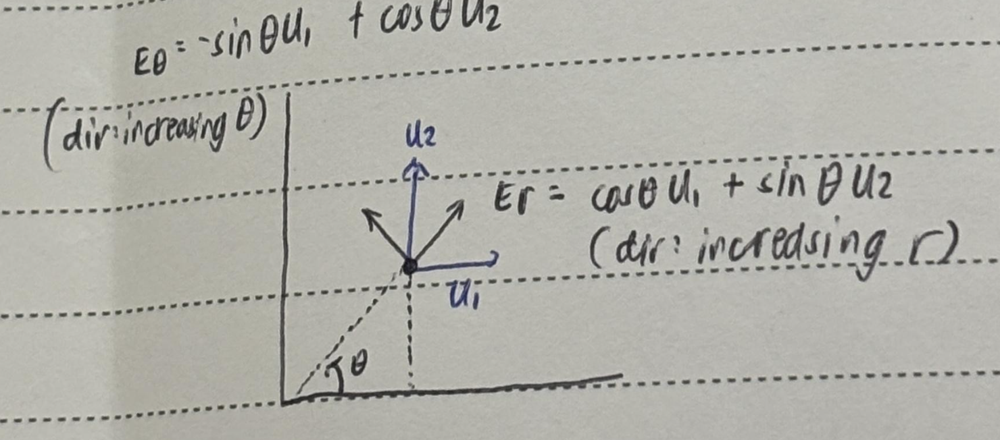

### Definition: Unit tangent, curvature vector, and curvature

We now attach moving vectors to a curve. Let $\beta:J\to\mathbb R^n$ be a smooth **unit-speed** curve, so $\|\beta'(s)\|=1$.

Its **unit tangent field**, **curvature vector field**, and **curvature function** are respectively

$$
\begin{aligned}
T(s)&=\beta'(s),\\
T'(s)&=\beta''(s),\\
\kappa(s)&=\|T'(s)\|=\|\beta''(s)\|.
\end{aligned}
$$

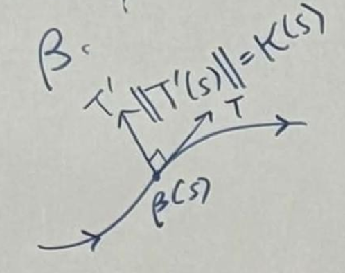

Because speed is fixed at one, $T'$ measures change of direction rather than change of speed. The scalar $\kappa$ measures how rapidly that direction changes per unit distance traveled.

### Exercise: Why curvature is perpendicular to the tangent

Show that

$$
g(T,T')=0.
$$

Use these useful differentiation facts for vector fields along a curve:

- If $g(X,X)$ is constant, then $g(X,X')=0$.
- If $g(X,Y)$ is constant, then $g(X',Y)=-g(X,Y')$.

Both follow by differentiating the inner product.

### Exercise: A circle

For $a>0$, consider the unit-speed circle

$$
\gamma(s)=\left(a\cos\frac{s}{a},\ a\sin\frac{s}{a},\ 0\right).
$$

Show that $T'$ points toward the center and that

$$
T'(s)=-\frac{1}{a^2}\gamma(s),\qquad \kappa(s)=\frac1a.
$$

Here the expression for $T'$ identifies vectors with their Euclidean components along $\gamma$.

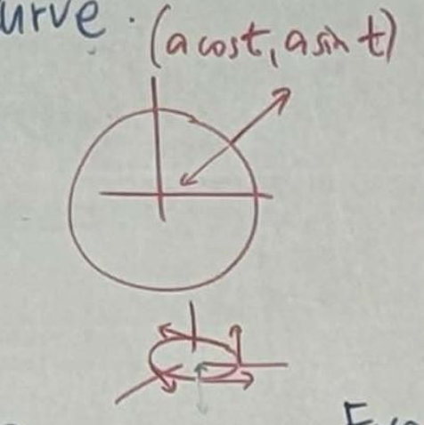

### Definition: Radius of curvature

Where $\kappa(s)>0$, the **radius of curvature** is $1/\kappa(s)$. For a circle it is exactly its radius. More generally, it is the radius of the circle that matches the curve's bending at that point.

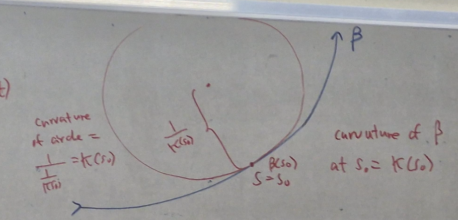

## Meeting 16 · March 18: The Frenet frame

### Review exercises

For a unit-speed curve, recall $T=\beta'$, $T'=\beta''$, and $\kappa=\|T'\|$. Revisit the circle from Meeting 15 and verify both the direction of $T'$ and the value $\kappa=1/a$.

### Theorem: Zero curvature characterizes straight lines

Let $J$ be an interval and $\beta:J\to\mathbb R^n$ be unit speed. Then $\kappa\equiv0$ if and only if

$$
\beta(s)=p+sv
$$

for constant vectors $p,v$ with $\|v\|=1$.

**Proof.** If $\kappa=\|\beta''\|=0$, then $\beta''=0$, so $\beta'$ is constant on $J$. Integrating gives the stated formula. Conversely, this formula gives $\beta''=0$ and hence zero curvature. ∎

### Exercise: A circular helix and two straight lines

Take $a>0$, $b\ne0$, and $c=\sqrt{a^2+b^2}$. Consider

$$
\begin{aligned}
\beta(s)&=\left(a\cos\frac{s}{c},\ a\sin\frac{s}{c},\ \frac{bs}{c}\right),\\
\lambda_+(s)&=(0,0,s),\\
\lambda_-(s)&=(0,0,-s).
\end{aligned}
$$

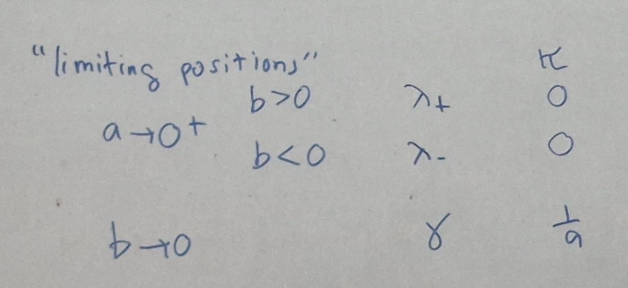

1. Sketch their images and check that all three curves are unit speed.
2. Show that the helix's curvature vector points toward the $z$-axis.
3. Show that its curvature is $a/(a^2+b^2)$.
4. Keeping $b\ne0$ fixed, examine the limit as $a\to0$. Keeping $a>0$ fixed, examine the limit as $b\to0$.

These limiting cases connect the helix to a straight line and a circle.

### Definition: Principal normal and binormal

For a unit-speed curve in $\mathbb R^3$ with $\kappa>0$, the **principal normal** is

$$
N=\frac{T'}{\kappa}.
$$

It is the unit vector in the direction in which the tangent turns.

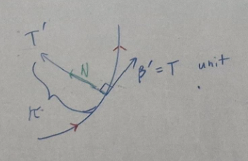

The **binormal** is

$$
B=T\times N.
$$

### Theorem: The Frenet frame is orthonormal

The fields $T,N,B$ form an orthonormal frame along the curve.

**Exercise.** Use $T\perp T'$, the definition of $N$, and properties of the cross product to prove the theorem.

### Definition: Torsion and the Frenet apparatus

For a unit-speed curve with $\kappa>0$, define **torsion** by

$$
\tau=g(N',B)=-g(B',N).
$$

The second equality follows by differentiating $g(N,B)=0$. Curvature measures bending; torsion measures the rotation of the normal-binormal directions along the curve.

The collection $T,N,B,\kappa,\tau$ is the **Frenet apparatus**. These definitions require positive curvature for $N$, $B$, and $\tau$.

### Worked example: The circle

For $\gamma(s)=(a\cos(s/a),a\sin(s/a),0)$,

$$
\begin{aligned}
T&=\left(-\sin\frac{s}{a},\ \cos\frac{s}{a},\ 0\right),\\
T'&=\left(-\frac1a\cos\frac{s}{a},\ -\frac1a\sin\frac{s}{a},\ 0\right),\\
\kappa&=\frac1a,\\
N&=\left(-\cos\frac{s}{a},\ -\sin\frac{s}{a},\ 0\right),\\
B&=T\times N=(0,0,1).
\end{aligned}
$$

Also,

$$
N'=\left(\frac1a\sin\frac{s}{a},\ -\frac1a\cos\frac{s}{a},\ 0\right),
\qquad \tau=g(N',B)=0.
$$

The circle bends, but its binormal does not turn.

### Worked example: The helix

For the unit-speed helix above,

$$
\begin{aligned}
T&=\left(-\frac ac\sin\frac sc,\ \frac ac\cos\frac sc,\ \frac bc\right),\\
T'&=\left(-\frac a{c^2}\cos\frac sc,\ -\frac a{c^2}\sin\frac sc,\ 0\right),\\
\kappa&=\frac a{c^2},\\
N&=\left(-\cos\frac sc,\ -\sin\frac sc,\ 0\right),\\
B&=\left(\frac bc\sin\frac sc,\ -\frac bc\cos\frac sc,\ \frac ac\right).
\end{aligned}
$$

Differentiating $N$ and taking its binormal component gives

$$
\begin{aligned}
N'&=\left(\frac1c\sin\frac sc,\ -\frac1c\cos\frac sc,\ 0\right),\\
\tau&=g(N',B)
=\frac b{c^2}\left(\sin^2\frac sc+\cos^2\frac sc\right)
=\frac b{c^2}.
\end{aligned}
$$

Thus

$$
\kappa=\frac a{a^2+b^2},\qquad
\tau=\frac b{a^2+b^2}.
$$

### Worked example: The straight lines

For $\lambda_+$ and $\lambda_-$, respectively,

$$
T_+=(0,0,1),\qquad T_-=(0,0,-1),\qquad \kappa_+=\kappa_-=0.
$$

Since $T'=0$, division by $\kappa$ is impossible. Their principal normal, binormal, and torsion are **undefined under these Frenet definitions**. In particular, do not assign torsion zero by applying a formula whose denominator is zero.

## Meeting 17 · March 25: Frenet formulas and planar curves

The frame gives a convenient way to decompose any vector field $X$ along the curve:

$$
X=g(X,T)T+g(X,N)N+g(X,B)B.
$$

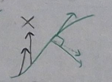

### Theorem: Frenet formulas for unit speed

If $\beta:J\to\mathbb R^3$ is unit speed and $\kappa>0$, then

$$
\begin{aligned}
T'&=\kappa N,\\
N'&=-\kappa T+\tau B,\\
B'&=-\tau N.
\end{aligned}
$$

**Review prompt.** Differentiate the inner products of $T,N,B$. For example, differentiating $g(T,T)=1$ gives $g(T',T)=0$, and differentiating $g(T,N)=0$ gives $g(N',T)=-\kappa$. These identities explain the coefficients in the formulas.

### Theorem: Planarity and zero torsion

Suppose $J$ is an interval and $\beta:J\to\mathbb R^3$ is unit speed with $\kappa>0$. Its image lies in a plane if and only if $\tau\equiv0$.

**Proof, zero torsion implies planarity.** If $\tau=0$, the third Frenet formula gives $B'=0$, so $B$ is a fixed unit vector $\widehat B$. Fix $s_0\in J$ and set

$$
f(s)=g\bigl(\beta(s)-\beta(s_0),\widehat B\bigr).
$$

Then $f'(s)=g(T(s),\widehat B)=0$. Since $f(s_0)=0$, the curve lies in the plane

$$
\left\{x\in\mathbb R^3:
 g\bigl(x-\beta(s_0),\widehat B\bigr)=0\right\}.
$$

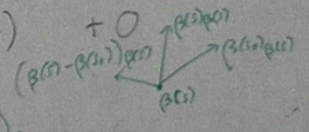

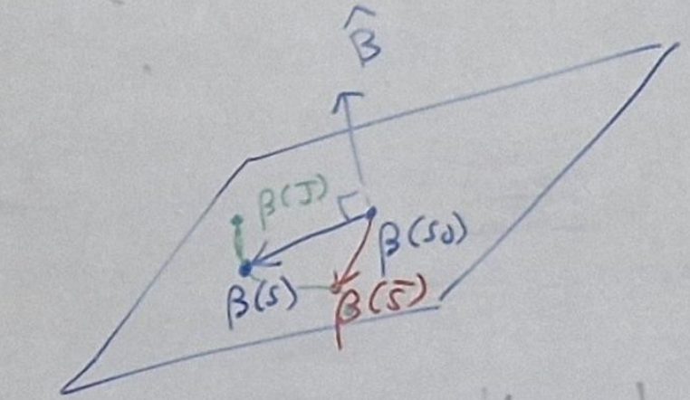

**Proof, planarity implies zero torsion.** Conversely, suppose the curve lies in a plane with nonzero constant normal $q$. Differentiating its plane equation gives

$$
g(T,q)=0,\qquad g(T',q)=\kappa g(N,q)=0.
$$

Since $\kappa>0$, both $T$ and $N$ are perpendicular to $q$. Hence

$$
B(s)=\pm\frac q{\|q\|}.
$$

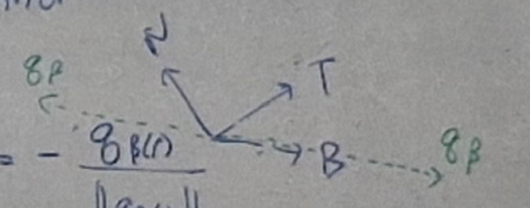

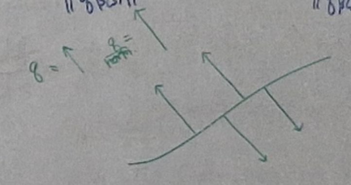

The sign cannot change continuously on the interval $J$: the continuous function $g(B,q/\|q\|)$ takes values only in $\{-1,1\}$, so it is constant. Therefore $B'=0$ and $\tau=-g(B',N)=0$. ∎

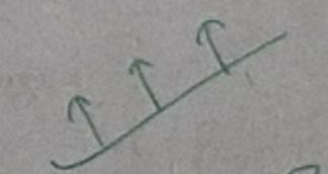

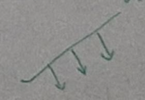

### Theorem: Characterizing a circle

A unit-speed curve with $\kappa>0$ has image contained in a circle if and only if $\tau\equiv0$ and $\kappa$ is a positive constant $\kappa_0$. The circle has radius $1/\kappa_0$.

The image may be only an arc; the theorem does not require the parameter interval to cover the whole circle.

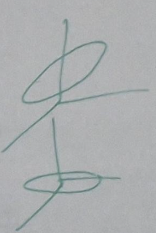

### General parametrizations: Where speed enters

Let $\alpha:I\to\mathbb R^3$ be regular, with speed $\nu(t)=\|\alpha'(t)\|>0$. Choose an arc-length function $s(t)$ satisfying $s'(t)=\nu(t)$. Its inverse $f$ gives the unit-speed reparametrization $\bar\beta=\alpha\circ f$.

Define the Frenet apparatus along $\alpha$ by pulling back the unit-speed apparatus; for example, $T(t)=\bar T(s(t))$ and $\kappa(t)=\bar\kappa(s(t))$.

The chain rule gives the general-parameter Frenet formulas:

$$
\begin{aligned}
\frac{dT}{dt}&=\nu\kappa N,\\
\frac{dN}{dt}&=-\nu\kappa T+\nu\tau B,\\
\frac{dB}{dt}&=-\nu\tau N.
\end{aligned}
$$

Each extra factor $\nu$ comes from $ds/dt$. This is the distinction to remember when using formulas from the unit-speed case.

### Exercise and calculation: Circle and helix with parameter $t$

For the circle $\alpha(t)=(a\cos t,a\sin t,0)$, the speed is $a$ and one can choose $s=at$. Substituting $s/a=t$ into the earlier apparatus gives

$$
\begin{aligned}
T&=(-\sin t,\cos t,0),&N&=(-\cos t,-\sin t,0),\\
B&=(0,0,1),&\kappa&=1/a,\qquad\tau=0.
\end{aligned}
$$

For the helix $\alpha(t)=(a\cos t,a\sin t,bt)$, the speed is $c=\sqrt{a^2+b^2}$ and one can choose $s=ct$. Its apparatus is

$$
\begin{aligned}
T&=\left(-\frac ac\sin t,\frac ac\cos t,\frac bc\right),\\
N&=(-\cos t,-\sin t,0),\\
B&=\left(\frac bc\sin t,-\frac bc\cos t,\frac ac\right),\\
\kappa&=\frac a{c^2},\qquad\tau=\frac b{c^2}.
\end{aligned}
$$

Verify the three general-parameter Frenet formulas directly for these examples.

## Meeting 18 · April 22: Computing directly from a regular curve

### Correct parameter-dependent formulas

For primes taken with respect to $t$, the definitions become

$$
\begin{aligned}
T&=\frac{\alpha'}{\nu},&
\kappa&=\frac{\|T'\|}{\nu},\\
N&=\frac{T'}{\nu\kappa},&
B&=T\times N,\\
\tau&=\frac{g(N',B)}{\nu}.&&
\end{aligned}
$$

The formulas for $N,B,\tau$ require $\kappa>0$. The supplied recap omitted the speed factors in several of these expressions; they are restored here to agree with the chain rule and the lecture's general-parameter Frenet formulas.

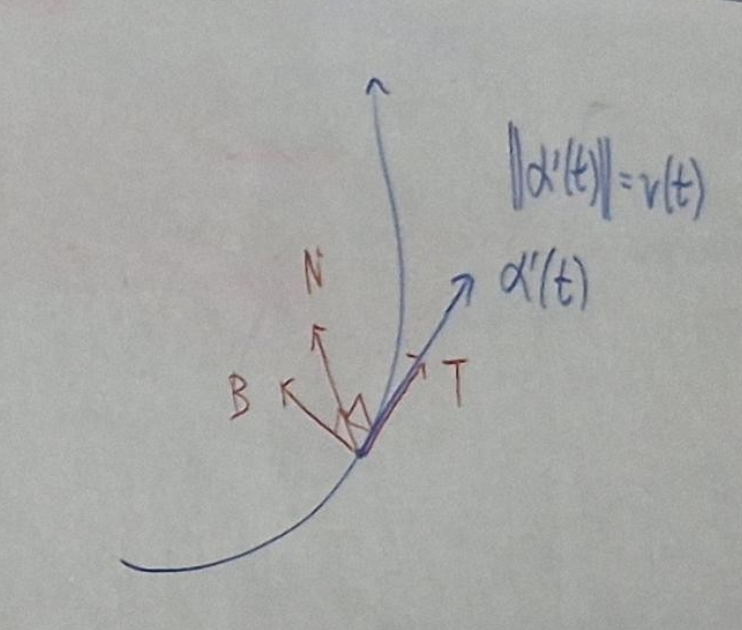

### Derivation: First and second derivatives

From $\alpha'=\nu T$,

$$
\begin{aligned}
\alpha''&=\nu'T+\nu T'\\
&=\nu'T+\nu^2\kappa N.
\end{aligned}
$$

Thus acceleration has a tangential component from changing speed and a normal component from changing direction.

Taking the cross product,

$$
\begin{aligned}
\alpha'\times\alpha''
&=(\nu T)\times(\nu'T+\nu^2\kappa N)\\
&=\nu^3\kappa B.
\end{aligned}
$$

### Theorem: Direct formulas

For a regular curve,

$$
T=\frac{\alpha'}{\|\alpha'\|},\qquad
\kappa=\frac{\|\alpha'\times\alpha''\|}{\|\alpha'\|^3}.
$$

Where $\alpha'\times\alpha''\ne0$,

$$
B=\frac{\alpha'\times\alpha''}{\|\alpha'\times\alpha''\|},\qquad
N=B\times T.
$$

**Homework.** Find an expression for torsion using $\alpha'$, $\alpha''$, and $\alpha'''$. The following meeting supplies the derivation.

## Meeting 19 · April 24: Torsion and the transition to surfaces

### Derivation: The torsion formula

Differentiate $\alpha''=\nu'T+\nu^2\kappa N$ and use the general-parameter Frenet formulas:

$$
\begin{aligned}
\alpha'''
&=\nu''T+\nu'T'+(\nu^2\kappa)'N+\nu^2\kappa N'\\
&=(\nu''-\nu^3\kappa^2)T
 +\bigl(\nu\nu'\kappa+(\nu^2\kappa)'\bigr)N
 +\nu^3\kappa\tau B.
\end{aligned}
$$

Since $\alpha'\times\alpha''=\nu^3\kappa B$, orthonormality gives

$$
g(\alpha'\times\alpha'',\alpha''')=\nu^6\kappa^2\tau,
\qquad
\|\alpha'\times\alpha''\|^2=\nu^6\kappa^2.
$$

Therefore, wherever the denominator is nonzero,

$$
\boxed{\displaystyle
\tau=\frac{g(\alpha'\times\alpha'',\alpha''')}
{\|\alpha'\times\alpha''\|^2}.}
$$

### From regular curves to regular maps

A regular curve has a nonzero velocity: its differential does not collapse the one available parameter direction. A surface parametrization has two parameter directions, and we will require its differential to preserve their independence.

### Theorem: Rank-nullity

For a linear map $L:\mathbb R^n\to\mathbb R^m$,

$$
\dim\ker L+\operatorname{rank}L=n.
$$

In particular, $L$ is one-to-one if and only if its rank is $n$.

### Definition: Homeomorphism

A **homeomorphism** $f:X\to Y$ is a continuous bijection whose inverse is continuous. It identifies two spaces without changing their topological structure.

The source also refers to a homeomorphism exercise as “See course notes,” but does not supply its statement. No replacement problem is inferred here.

### Definition: Regular smooth map $(\star)$

Let $V\subseteq\mathbb R^n$ be open. A smooth map $f:V\to\mathbb R^m$ is **regular** if, for each $p\in V$, its differential

$$
f_{*}|_p:T_p\mathbb R^n\longrightarrow T_{f(p)}\mathbb R^m
$$

is one-to-one. Equivalently, its Jacobian has rank $n$ everywhere. Such a map is also called an immersion.

### Exercises: Recognizing regularity

1. Prove the equivalence between injectivity of $f_*|_p$ and rank $n$ of the Jacobian (or its transpose).
2. Prove that $f_*|_p$ is not one-to-one if and only if it maps some one-dimensional subspace of $T_p\mathbb R^n$ to zero.
3. When $n=1$, prove that injectivity is equivalent to $f_*|_p(U_1|_p)\ne0$.
4. Deduce that a smooth curve $\alpha:I\to\mathbb R^m$ is regular as a curve if and only if it is regular as a map.

For the last exercise, recall

$$
\alpha'(a)=\alpha_*|_a(U_1|_a).
$$

### Definition: Coordinate patch

A two-dimensional **coordinate patch** in a surface $\Sigma\subseteq\mathbb R^n$ is a smooth regular map $\phi:V\to\mathbb R^n$, with $V\subseteq\mathbb R^2$ open, that is a homeomorphism onto an **open subset of $\Sigma$**.

The April 24 definition initially says only “a subset.” We use the clarified May 6 convention, which explicitly requires the image to be open in the surface.

### Exercise: The northern hemisphere

Let

$$
N=\{(x,y,z)\in S^2(1):z>0\}.
$$

Construct the canonical coordinate patch from the open unit disk $B(0;1)\subset\mathbb R^2$ to $N$, and prove regularity. The positive square root determines the height above each point of the disk.

## Meeting 19 · April 29: Surfaces, graphs, and level sets

### Exercise: Patching the sphere

Construct analogous patches for the hemispheres of the sphere and verify how their images cover it.

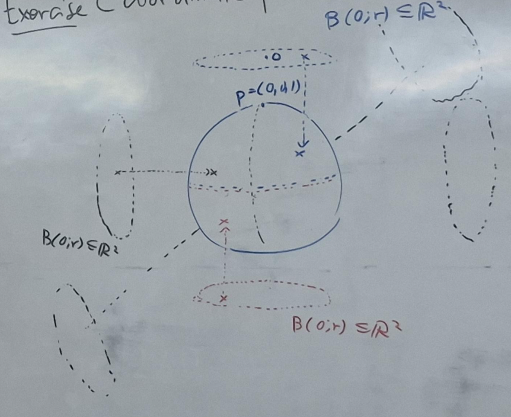

A patch is also a patch of its own image. When viewing it inside a larger set, however, check that its image is still open in that set; regularity and a continuous inverse alone do not establish this.

### Definition: Smooth surface

A nonempty subset $\Sigma\subseteq\mathbb R^n$ is a **smooth surface** if every point has an open neighborhood in $\Sigma$ that is the image of a coordinate patch.

Locally, a surface can be described by two parameters, even if one parametrization cannot cover the entire surface.

### Example and definition: Monge patches

Let $D\subseteq\mathbb R^2$ be open and $f:D\to\mathbb R$ smooth. The graph parametrization

$$
\phi(u,v)=(u,v,f(u,v))
$$

is a **Monge patch**. Its Jacobian is

$$
D\phi=
\begin{pmatrix}
1&0\\
0&1\\
f_u&f_v
\end{pmatrix},
$$

which has rank two. Its inverse on the graph is the continuous projection $(x,y,z)\mapsto(x,y)$. Hence it is regular and a homeomorphism onto its image.

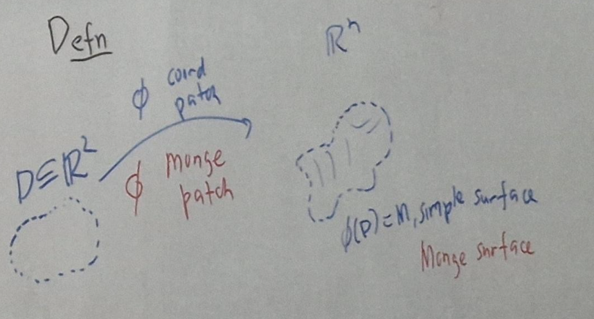

**Exercise.** Check these assertions carefully. Show also that the graph is a smooth surface. Permuting the three coordinates produces the other forms of a Monge patch.

### Definition: Simple surface

A **simple surface** is a surface that is the image of a single coordinate patch. A smooth graph is an example. General surfaces are assembled from such local descriptions.

### Definition: Level set

For a map $F:V\to\mathbb R^m$ and a value $k\in\mathbb R^m$, the level set at $k$ is

$$
F^{-1}(k)=\{p\in V:F(p)=k\}.
$$

A level set need not be a surface, or even nonempty. For instance, if $F(x,y,z)=x^2+y^2+z^2$, then $F^{-1}(1)$ is the unit sphere, while $F^{-1}(-1)=\varnothing$.

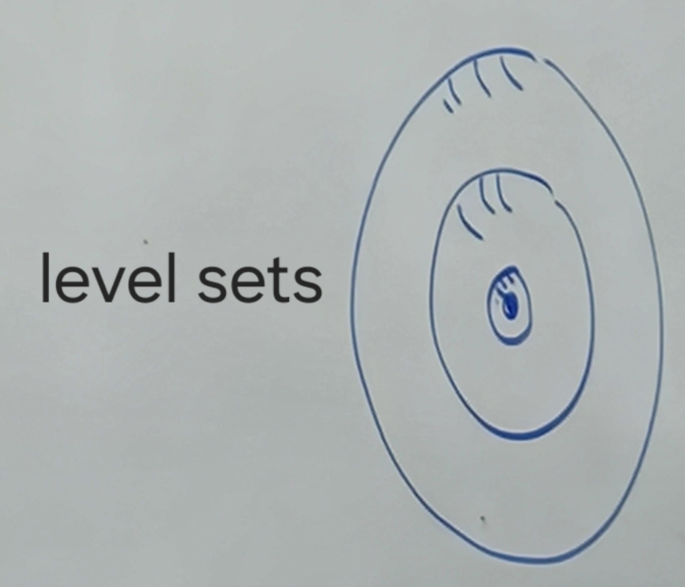

### Theorem: Implicit Function Theorem

Let $V\subseteq\mathbb R^{\ell+m}$ be open and $F:V\to\mathbb R^m$ smooth. Write the variables as $(x,y)\in\mathbb R^\ell\times\mathbb R^m$. Suppose $p=(a,b)\in V$, $F(a,b)=k$, and the square matrix

$$
D_yF(a,b)=
\begin{pmatrix}
\dfrac{\partial F_1}{\partial y_1}&\cdots&\dfrac{\partial F_1}{\partial y_m}\\
\vdots&\ddots&\vdots\\
\dfrac{\partial F_m}{\partial y_1}&\cdots&\dfrac{\partial F_m}{\partial y_m}
\end{pmatrix}_{(a,b)}
$$

is invertible. Then there are neighborhoods $W$ of $a$ and $Z$ of $b$, with $W\times Z\subseteq V$, and a unique smooth map $g:W\to Z$ such that

$$
g(a)=b,\qquad
F^{-1}(k)\cap(W\times Z)=\{(x,g(x)):x\in W\}.
$$

Thus, **near $p$**, the equation $F(x,y)=k$ determines $y$ smoothly from $x$. The uniqueness is local to the chosen neighborhoods.

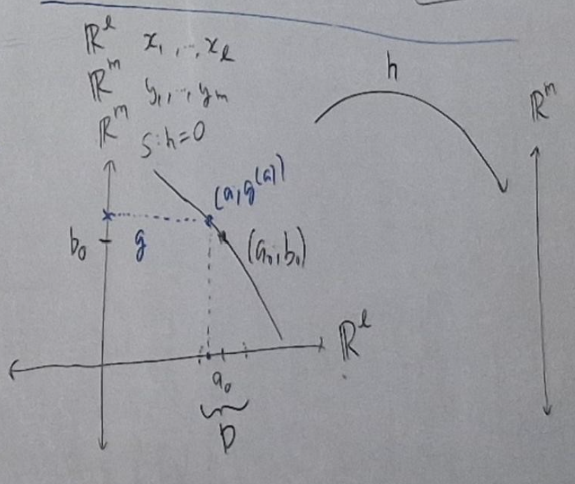

### Examples: Choosing a local graph

For $h(x,y)=x^2+y^2-5$, the equation $h=0$ describes a circle. Near a point where $y\ne0$, we can solve for $y$ as a smooth function of $x$. Where $x\ne0$, we can instead solve for $x$ in terms of $y$. A single graph does not describe the entire circle.

For a sphere of radius $r>0$, the northern hemisphere is parametrized over the open disk $B(0;r)$ by

$$
\phi_N(u,v)=\left(u,v,\sqrt{r^2-u^2-v^2}\right).
$$

The radicand is positive on the open disk. Notice the $r^2$: this formula is for a sphere of radius $r$.

### Theorem: Regular level sets are surfaces

Let $V\subseteq\mathbb R^3$ be open and $f:V\to\mathbb R$ smooth. If $f^{-1}(k)$ is nonempty and $df|_p\ne0$ at every $p\in f^{-1}(k)$, then $f^{-1}(k)$ is a smooth surface.

**Proof.** At any point $p$ of the level set, at least one partial derivative is nonzero. After relabeling coordinates, suppose $f_z(p)\ne0$. The Implicit Function Theorem expresses the level set near $p$ as a graph $z=g(x,y)$. Its Monge patch is regular and gives an open neighborhood of $p$ in the level set. Since this works at every point, the level set is a surface. ∎

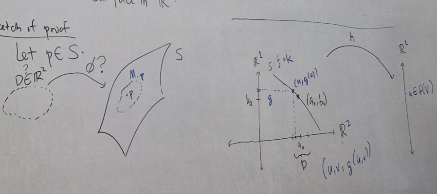

## Meeting 20 · May 6: Patches and tangent vectors

### Review: What a coordinate patch must satisfy

A patch must be smooth, regular, and a homeomorphism onto an open subset of the surface. Each condition has a role: smoothness permits differentiation, rank two preserves two independent directions, and the homeomorphism identifies a genuine local piece of the surface.

### Exercise: A geographical patch on the sphere

For $r>0$, consider

$$
\begin{aligned}
\phi:(-\pi,\pi)\times(-\pi/2,\pi/2)&\longrightarrow S^2(r),\\
\phi(u,v)&=(r\cos v\cos u,\ r\cos v\sin u,\ r\sin v).
\end{aligned}
$$

Show that this is a coordinate patch. Identify its image as the sphere with the seam

$$
\{(p_1,p_2,p_3)\in S^2(r):p_1\le0,\ p_2=0\}
$$

removed. The excluded seam includes both poles. The open ranges for longitude and latitude avoid the coordinate identifications and degeneracies there.

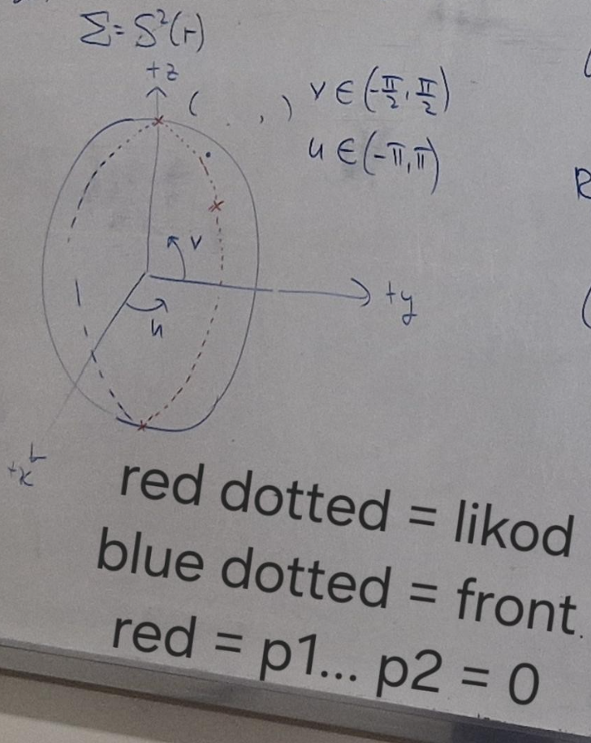

### Exercises: Restricting patches

1. Show that a coordinate patch is also a patch of its own image.
2. Show that restricting a patch to an open subset of its parameter domain again gives a patch.
3. Deduce that every nonempty open subset of a surface is a surface.

### Theorem: Equivalent descriptions of a surface

For a nonempty set $\Sigma\subseteq\mathbb R^n$, the following are equivalent:

1. $\Sigma$ is a smooth surface.
2. $\Sigma$ is covered by images of coordinate patches that are open in $\Sigma$.
3. $\Sigma$ is a union of simple surfaces, each open in $\Sigma$.

The point is locality: each point needs one suitable parametrized neighborhood, not a single global coordinate system.

### Review: The Implicit Function Theorem and the sphere

Recall the theorem from April 29: an invertible derivative in the variables to be solved for makes a level set a local graph. For one scalar equation in three variables, a nonzero differential is enough.

For $f(x,y,z)=x^2+y^2+z^2$ and $r>0$,

$$
S^2(r)=f^{-1}(r^2),\qquad df=2x\,dx+2y\,dy+2z\,dz.
$$

The differential can vanish only at the origin, which is not on this level set. Hence the sphere is a smooth surface.

### Parameter curves: Moving one coordinate at a time

Let $\phi:V\to\Sigma$ be a coordinate patch, $(u_0,v_0)\in V$, and $p=\phi(u_0,v_0)$. Holding one parameter fixed produces a curve on the surface.

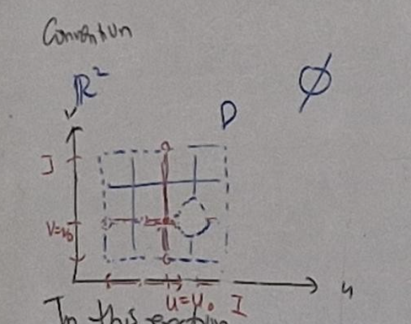

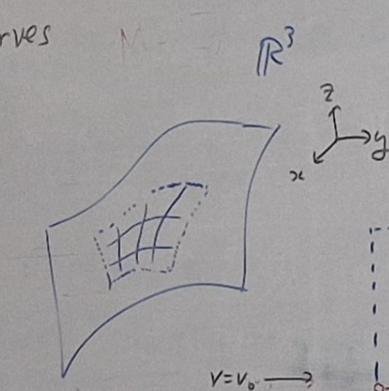

The **$u$-parameter curve** through $p$ is

$$
\phi_{v=v_0}(u)=\phi(u,v_0),\qquad u\in I,
$$

where $I$ is the open interval component containing $u_0$ of the slice $\{u:(u,v_0)\in V\}$.

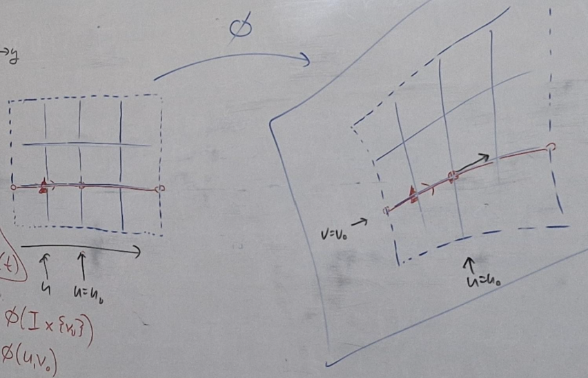

Its velocity at $u_0$ is

$$
\phi_{v=v_0}'(u_0)=\frac{\partial\phi}{\partial u}(u_0,v_0).
$$

**Exercise.** Establish this equality directly from the definition of derivative.

Similarly, the **$v$-parameter curve** through $p$ is

$$
\phi_{u=u_0}(v)=\phi(u_0,v),\qquad v\in J,
$$

where $J$ is the open interval component containing $v_0$ of the slice $\{v:(u_0,v)\in V\}$. Its velocity is

$$
\phi_{u=u_0}'(v_0)=\frac{\partial\phi}{\partial v}(u_0,v_0).
$$

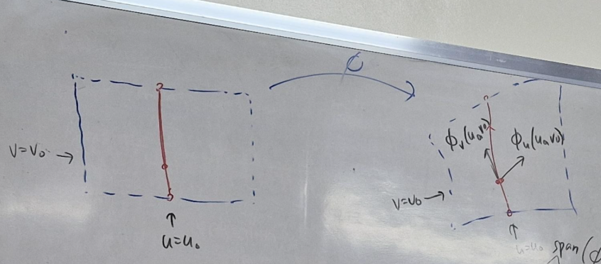

**Exercise.** Verify the second equality as well. Notice that this derivative is evaluated at $v_0$, the parameter of this curve.

### Definition: Partial velocities

The vectors

$$
\phi_u(u_0,v_0),\qquad \phi_v(u_0,v_0)
$$

are the **partial velocities** of the patch at $p$. Their base point is $p$, not the point $(u_0,v_0)$ in the parameter domain.

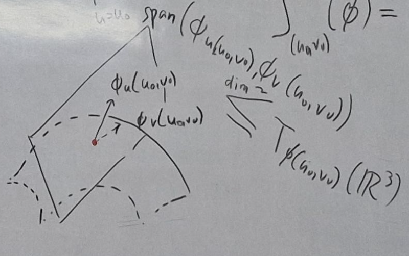

### Theorem: The partial velocities are independent

The vectors $\phi_u(u_0,v_0)$ and $\phi_v(u_0,v_0)$ are linearly independent.

Indeed, they are the columns of the $n\times2$ Jacobian of $\phi$, which has rank two because the patch is regular.

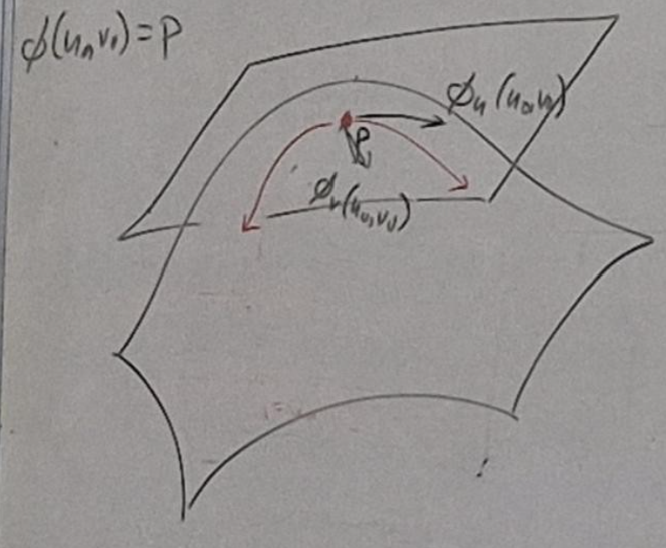

### Definition: Tangent vector and tangent space

A vector $v\in T_p\mathbb R^n$ is **tangent to $\Sigma$ at $p$** if there is a smooth curve $\alpha:(-\varepsilon,\varepsilon)\to\mathbb R^n$ with image in $\Sigma$ such that

$$
\alpha(0)=p,\qquad \alpha'(0)=v.
$$

The collection of these tangent vectors is denoted $T_p\Sigma$, the **tangent space** (or tangent plane) at $p$. The two partial velocities belong to $T_p\Sigma$ because they are velocities of the parameter curves just constructed.

This brings the discussion back to curves: tangent directions to a surface are detected by moving along curves within it.

## Meeting 21 · May 8: Differentiability on a surface

The supplied source opens this section with the convention that $\Sigma$ is a surface in $\mathbb R^n$. It provides no further definitions, statements, or proofs for this meeting.

## Editorial notes

The mathematical content above follows the supplied Unit II source and PDF. The following corrections clarify apparent transcription errors:

- Frame vectors must be nonzero; the frame expansion for fields is interpreted pointwise with smooth coefficients.
- For the unit-speed helix, $\kappa=a/c^2$, consistent with the computed second derivative.
- For a general parameter, $\kappa=\|T'\|/\nu$, $N=T'/(\nu\kappa)$, and $\tau=g(N',B)/\nu$.
- In the planarity proof, $B$ is constant when $B'=0$, and the conclusion is $\tau=0$.
- The differential of a map into $\mathbb R^m$ takes values in $T_{f(p)}\mathbb R^m$.
- The Implicit Function Theorem is stated with local neighborhoods, and the May 6 open-image convention for patches is used throughout.
- A sphere of radius $r$ is the level set $f^{-1}(r^2)$ for $f=x^2+y^2+z^2$, with hemisphere height $\sqrt{r^2-u^2-v^2}$.
- The velocity of the $v$-parameter curve is evaluated at $v_0$.

The original illustrations are retained in their source order. Unspecified exercises and the incomplete May 8 continuation are identified rather than reconstructed.
